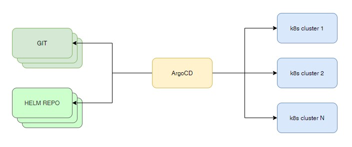

# Argo CD

[Документация](https://argo-cd.readthedocs.io/en/stable/)



## Cert-manager

[cert-manager](https://cert-manager.io/docs/installation/kubernetes/) - утилита
для управления сертификатами.

    # kubectl create namespace argocd
    # kubectl -n argocd create secret tls kube-ca-secret \
    --cert=/etc/kubernetes/ssl/ca.crt \
    --key=/etc/kubernetes/ssl/ca.key

    # kubectl apply -f https://github.com/jetstack/cert-manager/releases/download/v1.2.0/cert-manager.yaml

Namespace cert-manager создаётся автоматически.

## Установка

    # curl -o install.yaml https://raw.githubusercontent.com/argoproj/argo-cd/v2.0.1/manifests/install.yaml

Я разбил это файл на два: argo-1.yaml и argo-2.yaml. В первом файле находятся CRD. Его менять не будем.

Во втором файле будем изменять аргументы командной строки.

    # kubectl -n argocd apply -f https://raw.githubusercontent.com/BigKAA/youtube/master/argocd/argo-1.yaml
    # kubectl -n argocd apply -f https://raw.githubusercontent.com/BigKAA/youtube/master/argocd/argo-2.yaml

## Настраиваем ingress для доступа.

    # kubectl apply -f 00-certs.yaml

Ставим ingress controller. _После установки argocd этот контроллер будет добавлен в CD argo._
    
    # kubect apply -f 01-ingress-controller.yaml

Добавляем ingress

    # kubectl apply -f 02-ingress.yaml

## Установка CLI

    # curl -sSL -o /usr/local/bin/argocd https://github.com/argoproj/argo-cd/releases/download/v2.0.1/argocd-linux-amd64
    # chmod +x /usr/local/bin/argocd
    # argocd version

## Пароль админа

Добавим в /etc/hosts имя argocd.kryukov.local

    # kubectl -n argocd get secret argocd-initial-admin-secret -o jsonpath="{.data.password}" | base64 -d ; echo
    # argocd login argocd.kryukov.local:31443 --grpc-web
    # argocd account update-password --grpc-web

## Добавление пользователя

Добавляем пользователя в argocd-cm

    # kubectl apply -f 03-argocd-cm.yaml

Добавляем пользователю роль админа в argocd-rbac-cm

    # kubectl apply -f 04-argocd-rbac-cm.yaml

Затем в командной строке получаем список

    # argocd account list --grpc-web

    # argocd account update-password --account artur --grpc-web
    *** Enter current password:        <---- admin password
    *** Enter new password:
    *** Confirm new password:
    Password updated

Логинимся новым пользователем в систему

    # argocd login argocd.kryukov.local:31443 --grpc-web
    # argocd cluster list

Заходим в WEB интерфейс

    https://argocd.kryukov.local:31443/

## Ссылка на видео.

[](https://youtu.be/96K9ui-phE0)

[](https://youtu.be/jIMF5CQaW7c)

## Helm

Про это способ установки в видео не говорилось. Но, по сути, это самый правильный метод установки. :)
Рекомендую использовать именно его, после того как попробуете ставить Арго руками.

[Helm chart argo-cd](https://github.com/argoproj/argo-helm/tree/main/charts/argo-cd).

```shell
helm repo add https://argoproj.github.io/argo-helm
```

```shell
helm install argocd argocd/argo-cd -f argo-values.yaml -n argocd --create-namespace
```

Как генерировать пароль для админа написано в комментариях к secret в файле `argo-values.yaml`.