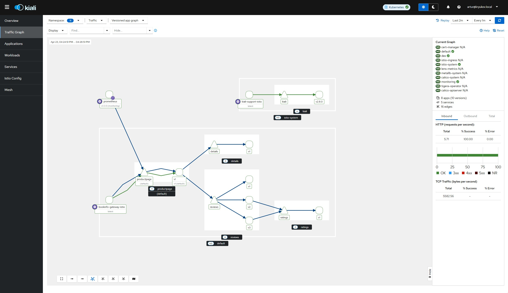

# Примеры использования Istio

- [Примеры использования Istio](#примеры-использования-istio)
  - [L4](#l4)
    - [AuthorizationPolicy](#authorizationpolicy)
  - [L7](#l7)
    - [Waypoint](#waypoint)
    - [Включение маршрутизации запросов](#включение-маршрутизации-запросов)


На данный момент мы установили Istio в режиме ambient. Поставили WEB интерфейс kiali (https://kiali.kryukov.local). Развернули тестовое приложение (http://192.168.218.181). Но функционал istio еще не работает.

Для включения Istio необходимо пометить namespaces. В нашем случае, тестовое приложение находится в namespace default. Поэтому этот namespace мы пометим меткой `istio.io/dataplane-mode=ambient`

```shell
kubectl label namespace default istio.io/dataplane-mode=ambient
```

Сгенерируем трафик на тестовое приложение:

```shell
for i in $(seq 1 100); do curl -sSI -o /dev/null http://192.168.218.181/productpage; done
```

Заходим в Kiali (https://kiali.kryukov.local/) и открываем закладку `Traffic Graph`



В моем примере показаны все namespaces.

Что бы понять обозначения на схеме, включите отображение легенды (последняя кнопка внизу схемы).

Синими стрелками показываются соединения L4, зелеными L7.

На схеме можно выбирать любые элементы и получать краткую информацию о них в правой части окна.

## L4

Функции уровня L4, которые нам предоставляет ztunnel, будут работать только если мы установили соответствующий CNI плагин.

### AuthorizationPolicy

https://istio.io/latest/docs/reference/config/security/authorization-policy/

Ztunnel шифрует все соединения при помощи mTLS. Для этих соединений istiod выпускает сертификаты, которые можно использовать в том числе и для ограничения доступа.

Что бы использовать `AuthorizationPolicy`, необходимо создавать `ServiceAccount` для приложения. 

Опишем `AuthorizationPolicy`:

```yaml
apiVersion: security.istio.io/v1
kind: AuthorizationPolicy
metadata:
  name: productpage-ap
spec:
  selector:
    matchLabels:
      app: productpage
  action: ALLOW
  rules:
  - from:
    - source:
        principals:
        - cluster.local/ns/default/sa/bookinfo-gateway
```

В политике мы разрешаем (`action: ALLOW`) доступ к приложению(ям) метки которого совпадают с `app: productpage`. В правилах `rules` мы описываем, кто может подключаться к этим приложениям. Мы ранее добавляли `Gateway` bookinfo-gateway, при помощи которого давали доступ к приложению из-за пределов кластера (ingress). Он работает с правами `ServiceAccount` `bookinfo-gateway-istio`. При помощи `principals` мы описываем путь к `ServiceAccount` приложения в нашем кластере: `cluster.local/ns/default/sa/bookinfo-gateway`. *Подробнее про возможные атрибуты политик можно прочитать в [документации](https://istio.io/latest/docs/ambient/usage/l4-policy/#allowed-policy-attributes).*

Добавим `AuthorizationPolicy`:

```shell
kubectl apply -f manifests-samples/01-productpage-ap.yaml
```

Попробуем подключиться к приложению:

```shell
curl http://192.168.218.181/productpage
```

В том же namespace запустим deploymnet с приложением curl. Оно будет запускаться в правми другого `ServiceAccount`:

```yaml
apiVersion: v1
kind: ServiceAccount
metadata:
  name: curl
```

``` shell
kubectl apply -f manifests-samples/02-curl.yaml
```

Попробуем из контейнера подключиться к приложению:

```shell
kubectl exec deploy/curl -- curl -s "http://productpage:9080/productpage"
```

Поправим `AuthorizationPolicy`, добавив в неё разрешение подключения для `ServiceAccount` curl:

```yaml
apiVersion: security.istio.io/v1
kind: AuthorizationPolicy
metadata:
  name: productpage-ap
spec:
  selector:
    matchLabels:
      app: productpage
  action: ALLOW
  rules:
  - from:
    - source:
        principals:
        - cluster.local/ns/default/sa/bookinfo-gateway
        - cluster.local/ns/default/sa/curl
```

Применим `AuthorizationPolicy`:

```shell
kubectl apply -f manifests-samples/03-productpage-ap-curl.yaml
```

Попробуем из контейнера подключиться к приложению:

```shell
kubectl exec deploy/curl -- curl -s "http://productpage:9080/productpage"
```

Теперь доступ к приложению разрешен.

Удалим `AuthorizationPolicy` и curl:

```shell
kubectl delete -f manifests-samples/03-productpage-ap-curl.yaml -f manifests-samples/02-curl.yaml
```

## L7

### Waypoint

Для обработки трафика L7 необходимо использовать прокси сервер Envoy. Не смотря на то, что такой прокси в namespace у нас уже есть: `kind: Gateway`, `name: bookinfo-gateway`. Но он не подходит для работы с трафиком внутри namespace. Он был настрое для работы с ingress трафиком.

Для работы внутри мы добавим еще один `Gateway`:

```yaml
apiVersion: gateway.networking.k8s.io/v1
kind: Gateway
metadata:
  labels:
    istio.io/waypoint-for: service
  name: waypoint
spec:
  gatewayClassName: istio-waypoint
  listeners:
  - name: mesh
    port: 15008
    protocol: HBONE
```

Согласно метки `istio.io/waypoint-for: service` он будет обслуживать сервисы внутри namespace.

```shell
kubectl apply -f manifests-samples/04-waypoint-gw.yaml
```

Так же на namespace необходимо поставить метку, указывающую, какой конкретно weypoint будет использоваться в этом namespace.

```shell
kubectl label namespace default istio.io/use-waypoint=waypoint
```

Теперь мы готовы колдовать с трафиком L7.

### Включение маршрутизации запросов

По умолчанию приложение `productpage` посылает запросы ко всем 3-м версиям приложения `reviews`. Там используется стандартный сервис у которого селектор настроен на метки `app=reviews`.

Добавим сервисы, которые учитывают версии приложений:

```shell
kubectl apply -f bookinfo/bookinfo-versions.yaml
```

Попробуем сделать так, что все запросы будут пересылаться только на первую версию приложения `reviews`. Для этого на потребуется определить `HTTPRoute`:

```yaml
apiVersion: gateway.networking.k8s.io/v1
kind: HTTPRoute
metadata:
  name: reviews
spec:
  parentRefs:
  - group: ""
    kind: Service
    name: reviews
    port: 9080
  rules:
  - backendRefs:
    - name: reviews-v1
      port: 9080
```

Обратите внимание на секцию `parentRefs`. 

```shell
kubectl apply -f manifests-samples/05-httpr-one-version.yaml
```

Запустим трафик к приложению:

```shell
for i in $(seq 1 10); do curl -s http://192.168.218.181/productpage | grep reviews-v.- ; done
```

Изменим HTTPRoute так, что бы 80% запросов уходило на `reviews-v1`, а 20% на `reviews-v2`:

```yaml
apiVersion: gateway.networking.k8s.io/v1
kind: HTTPRoute
metadata:
  name: reviews
spec:
  parentRefs:
  - group: ""
    kind: Service
    name: reviews
    port: 9080
  rules:
  - backendRefs:
    - name: reviews-v1
      port: 9080
      weight: 80
    - name: reviews-v2
      port: 9080
      weight: 20
```

```shell
kubectl apply -f manifests-samples/06-httpr-one-two-version.yaml
```

Проверяем, что получилось в итоге:

Запустим трафик к приложению:

```shell
for i in $(seq 1 20); do curl -s http://192.168.218.181/productpage | grep reviews-v.- ; done
```