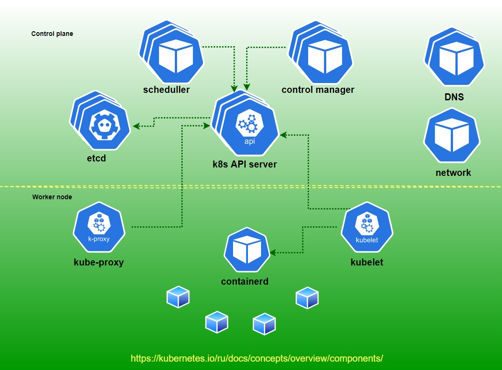
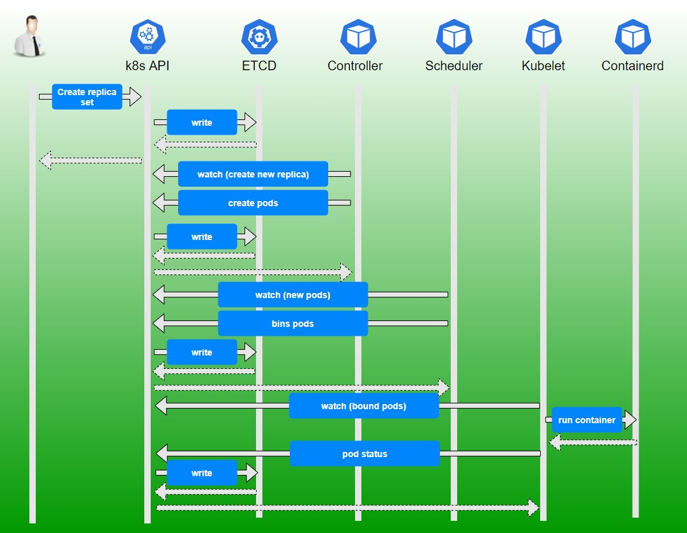
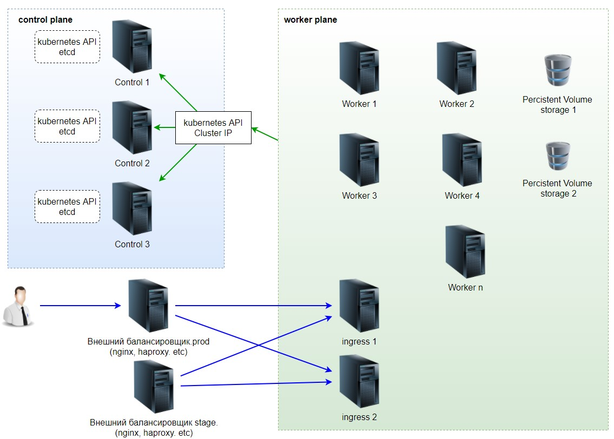

# Планирование

## Компоненты кластера

## Последовательность запросов

Простой пример, демонстрирующий последовательность запросов при создании Replica set. 
Для Daemon set и Statefull set картинка будет аналогичной. 

## Виртуальные машины

* Control plane.
    * Нечетное количество. Желательно минимум 3 шт.
    * Минимум 2 CPU.
    * Минимум 4GB RAM.
    
* Worker nodes.
    * Количество машин. Посчитать потребности исходя из:
        * Каждый микросервис должен быть как минимум в двух экземплярах.
        * По возможности микросервисы должны деплоится на разных машинах кластера.
        * Не более ~20-30 микросервисов на ноде.
        * Если необходимо, предусмотреть запас на автоскейлинг приложений.
        * Итоговое значение + минимум 1 нода кластера.

* На всех нодах кластера отключить:
    * swap
    * selinux
    * firewall

## Приложения, облегчающие жизнь администратора.

* [Reloader](https://github.com/stakater/Reloader) - осуществляет перезагрузку подов после изменения
config maps.

* [metrics-server](https://github.com/kubernetes-sigs/metrics-server) - необходим для работы
механизма автоматического горизонтального масштабирования подов. И для
  отображения данных при вызове команды kubectl top ...
  
* [cert-manager](https://github.com/jetstack/cert-manager) - система для управления 
сертификатами.

* [NFS-Client Provisioner](https://github.com/kubernetes-sigs/nfs-subdir-external-provisioner) -
PV provisioner. Удобный способ подключения NFS дисков к подам.
  
* [ingress-nginx](https://github.com/kubernetes/ingress-nginx) - ingress controller. Можно выбрать
любой контроллер исходя из потребностей. ingress-nginx наиболее привычный, поскольку
  построен на базе nginx.
  
* Система мониторинга.

* Система сбора логов.

## Видео

