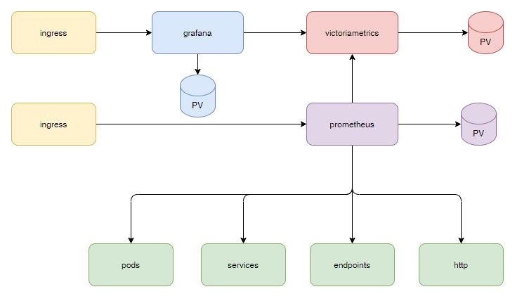

# Мониторинг 

## SSL сертификат

Сертификат для ingress был создан в предыдущем видео. См. 03-utils/02-certs.yaml

Если вы его не создавали, сначала добавьте сикрет:

    kubectl -n monitoring create secret tls kube-ca-secret \
    --cert=/etc/kubernetes/ssl/ca.crt --key=/etc/kubernetes/ssl/ca.key

Затем примените файл 00-certs.yaml

## Схема

### Хранилище метрик - victoriametrics

[victoriamerics](01-victoriametrics/README.md)

### Сбор метрик - prometheus

[prometheus](02-prometheus/README.md)

### Отображение метрик - grafana

[grafana](03-grafana/README.md)

### Видео

