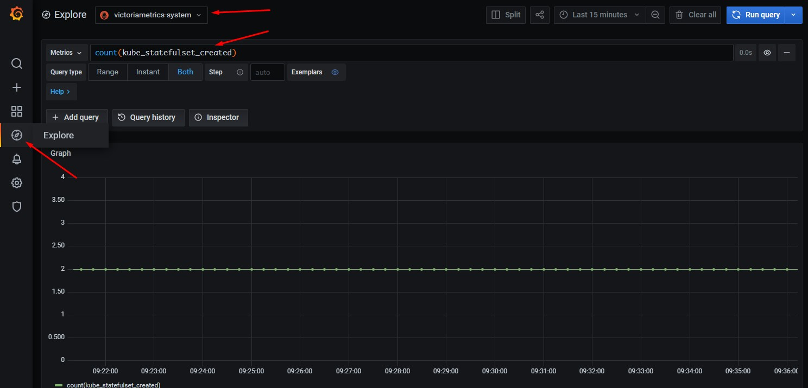

# Сбор метрик только при помощи victoriametrics

## victoriametrics

В предыдущем [видео](../04-monitoring%20(victoriametrics%20+%20prometheus)/README.md) из схемы сбора 
метрик можно смело удалять prometheus. Функцию срапинга может
осуществлять сама vicoriametrics.

Если обратиться к [документации](https://victoriametrics.github.io/Single-server-VictoriaMetrics.html#how-to-apply-new-config-to-victoriametrics),
становится понятно, что victoriametrics понимает формат конфигурационного
файла prometheus, с некоторыми ограничениями.

Для включения механизма скарпинга необходимо использовать параметр
_-promscrape.config_. В качестве значения указывается конфигурационный
файл prometheus.

В файле _01-victoriametrics.yaml_ показано как подключить
конфигурационный файл prometheus. Также добавлен аргумент
командной строки _-selfScrapeInterval=15s_, который заставляет
victoriametrics собирать свои собственные метрики.

К сожалению у victoriametrics нет своего web интерфейса, аналога 
/graph prometheus. Поэтому рекомендуется использовать grafana и её
инструмент Explore.

## vmagent

В больших системах, для сбора метрик рекомендуется использовать [vmagent](https://victoriametrics.github.io/vmagent.html).
Он тоже понимает формат конфигурационного файла prometheus.

Образ [контейнера](https://hub.docker.com/r/victoriametrics/vmagent).

## Видео

