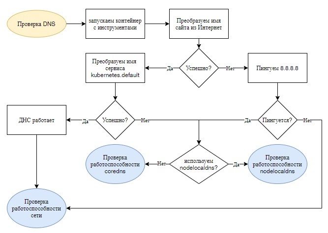

# Проверка работоспособности.

На данный момент в кластере запущены только служебные приложения.

```shell
watch kubectl get pods -A
```

Бывают ситуации, что приложения запущены. Вы **не** наблюдаете их частые рестарты. Но что-то с кластером не так.

Наиболее распространённые проблемы связаны с работой сети. Поэтому необходимо проверить работоспособность: DNS,
kube-proxy (сервисы), CNI plugin, общие сетевые доступы.

Для проверки работоспособности системы я пользуюсь контейнером `infoblox/dnstools:latest`. В нём есть все необходимые
инструменты для проверки сети. Конечно, можно было бы поставить все необходимые приложения на первую control ноду, 
но зачем мусорить если есть контейнеры?

```shell
kubectl run -it --rm --restart=Never --image=infoblox/dnstools:latest dnstools
```

## DNS

**Если не работает внутренний DNS сервер, у вас ничего не работает.**



Внутри контейнера dnstools проверим преобразование имён в Интернет и внутренних.

```shell
host mail.ru
host kubernetes.default
```

Всй хорошо, но не работает? Смотрим что с сетью.

### Nodelocaldns

Если используется nodelocaldns.

Проверяем, какой DNS сервер сейчас используется в контейнере `dnstools`.

```shell
cat /etc/resolv.conf
```

Там должен быть IP адрес nodelocaldns.

Проверяем, все ли поды nodelocaldns в состоянии Running и у них корректно отработали все пробы.

Смотрим логи сервера, который находится на ноде, где запущен под с инструментами проверки.

#### Некоторые ошибки.

Самая распространённая ошибка - преобразования имен из Интернет работают, локальные преобразования не работают.

Обычно в логах видим, что nodelocaldns не может подключиться к coredns.

Возможные варианты:

* Не работает coredns
  - Проверяем работоспособность coredns 
* Не установлен или не работает драйвер CNI.
  - Проверяем все ли в порядке с сетевым драйвером.
* При конфигурации кластера не верно указан IP адрес сервиса или подов coredns.
  - Смотрим какой IP у сервиса `kube-dns`, сверяем с настройками nodelocaldns.

```shell
kubectl -n kube-system get svc
kubectl -n kube-system get cm nodelocaldns -o yaml
```

### Coredns

Сразу смотрим логи, обычно там всё написано.

## Сеть

### Не работают сервисы.

Проверить можно двумя способами:

1. Не преобразуются DNS имена сервисов типа `kenernetes.default`.
2. Посмотреть параметры сетевого интерфейса `kube-ipvs0`. 

Во втором случае у интерфейса `kube-ipvs0` не будет IP адресов.

Проблема скорее всего в `kube-proxy` на конкретном хосте. Он всегда будет запускаться и работать. Проблему 
следует искать у него в логах.

```shell
kubectl -n kube-system logs kube-proxy-XXXXX
```

### Не подключается к API kubernetes

В логах приложения control plane (тот же kube-proxy) пишут сообщение о невозможности подключения к API kubernetes.

Первый вариант. Эта ошибка возникает у кластеров установленных при помощи kubespray. В большинстве случаев неправильно 
сконфигурирован или не запущен nginx, кеширующий запросы к API.

Второй вариант - протухли сертифкаты кластера. Обновите их.

## Kubelet

На запускается kubelet.

Всегда смотрим его логи. Поскольку это обычное приложение на сервере Linux, логи доступны либо через
systemd, либо в `/var/log/messages`. Последнее будет работать если установлен какой-либо вариант syslog.

```shell
journalctl -xeu kubelet
```

В подавляющем большинстве случаев протухли сертифкаты кластера. Обновите их.

## Disk pressure

Сразу после установки кластера такая ситуация возникать не должна. Хотя, если вы выделили очень маленький диск...

Disk pressure - сигнализирует о том, что у вас на диске нет места для работы контейнеров. Конечно по хорошему, задолго
до возникновения такой ситуации ваша система монитронга должна выдать предупреждение о заканчивающемся дисковом 
пространстве на сервере. Но предположим, что вы всё же получили состояние disk pressure на ноде кластера.

В большинстве случаев disk pressure возникает если приложения считают, что тома типа emptyDir на кластере безразмерные.
На самом деле, физически эти файловые системы располагаются где-то в глубинах директории `/var/lib/containers`.

Что делать?

1. [Провести воспитательную беседу с devops](https://www.kryukov.biz/2022/07/pozhelaniya-devops-am/), которые 
   используют ваш кластер.
2. Выделить под `/var/lib/containers` отдельный диск большого размера. Из моей практики хватало 100Gb при правильных
   devops инженерах.
3. Почистить хранилище контейнеров от неиспользуемых образов. Для containerd команда `crictl rmi --prune`.