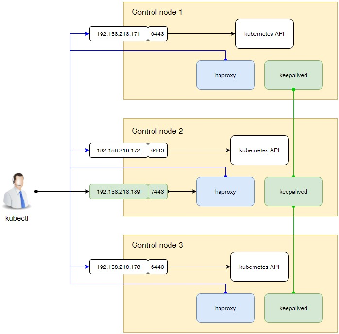

# High availability kubernetes API

На рисунке показано что и как будет взаимодействовать.



В первую очередь нам понадобится кластерный IP адрес (в нашем примере это 192.168.219.189). 
Этот IP будет подниматься на одной из control node кластера. Если нода, на которой он был включён, по какой-то причине
будет выключена, этот IP будет поднят на другой control ноде. За этот функционал отвечает приложение 
[keepalived](https://keepalived.org), которое необходимо установить и настроить на каждой control ноде.

Все приложения (за пределами кластера kubernetes), которые захотят обращаться к kubernetes API, будут обращаться
на кластерный IP.

Второе приложение, которе нам понадобится - это [haproxy](https://www.haproxy.org/). Этот прокси сервер будет слушать
запросы на кластерном IP и пересылать их на реальные IP адреса машин, где физически находится kubernetes API.

Haproxy пересылает пакеты на машины по принципу round robbin, т.е. по очереди. Он контролирует доступность серверов.
И, если какой-либо сервер будет недоступен, он перестанет пересылать пакеты на него. 

Согласно нашей схемы, клиенты будут присылать запросы на 192.168.218.198:7443. Haproxy, запущенный на каждой
control ноде кластера, будет их пересылать на эти ноды, но на реальный IP адрес и на порт 6443.

Таким образом, нам придётся настроить и включить два приложения: keepalived и haproxy.

Потенциально их можно в дальнейшем запустить в кластере kubernetes или в виде контейнеров в containerd. Но я
думаю, что не стоит так заморачиваться. Эти приложения относятся к разряду "один раз настроил и забыл". Поэтому мы
поставим их как обычные приложения сервера. Но не забудем потом, при установке кластера, зарезервировать ресурсы под
такие системные приложения.

## keepalived

Установим приложение:

```shell
dnf install -y keepalived
```

На первой control ноде кластера, где будет располагаться мастер keepalived, отредактируем файл
`/etc/keepalived/keepalived.conf`:

```
vrrp_script chk_haproxy {
  script "killall -0 haproxy" # check the haproxy process
  interval 2                  # every 2 seconds
  weight 2                    # add 2 points if OK
}

vrrp_instance VI_1 {
  interface ens33            # interface to monitor
  state MASTER                # MASTER on master, BACKUP on slaves

  virtual_router_id 51
  priority 101                # 101 on master, 100 on slaves

  virtual_ipaddress {
    192.168.218.189/24          # virtual ip address
  }

  track_script {
    chk_haproxy
  }
}
```

На остальных conrol нодах это файл будет выглядеть так:

```
vrrp_script chk_haproxy {
  script "killall -0 haproxy" # check the haproxy process
  interval 2                  # every 2 seconds
  weight 2                    # add 2 points if OK
}

vrrp_instance VI_1 {
  interface ens33            # interface to monitor
  state BACKUP                # MASTER on master, BACKUP on slaves

  virtual_router_id 51
  priority 100                # 101 on master, 100 on slaves

  virtual_ipaddress {
    192.168.218.189/24          # virtual ip address
  }

  track_script {
    chk_haproxy
  }
}
```

Запустим keepalived:

```shell
systemctl enable keepalived
systemctl start keepalived
systemctl status keepalived
```

Проверим, появился ли в сети кластерный IP и, если появился, на какой машине он приземлился. 

```shell
ping -c4 192.168.218.189
ip n l
```

Если всё будет верно, то мы увидим MAC адрес сетевого интерфейса первой control кластера kubernetes.

## haproxy

Установим приложение:

```shell
dnf install -y haproxy
```

Отредактируем конфигурационный файл приложения `/etc/haproxy/haproxy.cfg`:

```
global
    chroot      /var/lib/haproxy
    pidfile     /var/run/haproxy.pid
    maxconn     4000
    user        haproxy
    group       haproxy
    daemon

defaults
    log     global
    mode    tcp
    retries 2
    timeout client 30m
    timeout connect 4s
    timeout server 30m
    timeout check 5s

frontend main
    bind 192.168.218.189:7443
    default_backend             app

backend app
    balance     roundrobin
    server control1 192.168.218.171:6443 check
    server control2 192.168.218.172:6443 check
    server control3 192.168.218.173:6443 check

listen stats
    bind *:9000
    mode http
    stats enable  # Enable stats page
    stats hide-version  # Hide HAProxy version
    stats realm Haproxy\ Statistics  # Title text for popup window
    stats uri /haproxy_stats  # Stats URI
```

Включим haproxy:

```shell
systemctl enable haproxy
systemctl start haproxy
systemctl status haproxy
```

Поскольку у нас включен модуль статистики, мы можем к нему подключиться. Для этого в браузере откройте следующую
страницу `http://192.168.218.189:9000/haproxy_stats`.

## Немного автоматизации

Ansible [install-ha.yaml](https://github.com/BigKAA/00-kube-ansible/blob/main/services/install-ha.yaml)