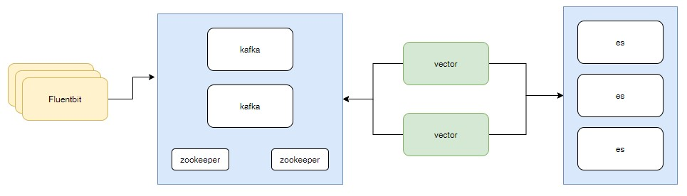

# Пример системы сбора логов с асинхронной очередью.

В системе увеличилось количество приложений. Поток логов растёт со страшной силой.
Elasticsearch пыхтит на грани возможного. Необходимо сделать процесс добавление логов в elastic асинхронным.

Задача: 
1. Настроить kafaka.
2. Настроить сборщик логов fluentbit на передачу логов в kafka.
3. Настроить [vector](https://vector.dev/docs) забирать логи из kafka и сохранять их в elasticsearch.

За основу берём чарты:
* от Bitnami:
  * [Kafka](https://github.com/bitnami/charts/tree/master/bitnami/kafka).
  * [elasticsearch](https://github.com/bitnami/charts/tree/master/bitnami/elasticsearch).
* [vector](https://helm.vector.dev).
* [fluentbit](https://fluent.github.io/helm-charts).

[WEB интерфейс](https://github.com/obsidiandynamics/kafdrop) для kafka. Мне их чарт не понравился. Поэтому малость его
модифицировал и [положил тут](charts/kafdrop).

Вместо elasticsearch можно использовать его клон [opensearch](https://opensearch.org/docs/latest). Я сделал [чарт 
обертку](charts/opensearch-art), в котором сразу и opensearch и opensearch dashboards (клон kibana).

## Видео

* [Telegramm](https://t.me/arturkryukov/43)
* [VK](https://vk.com/video7111833_456239197)
* [YouTube](https://youtu.be/g21BJQX9-34)