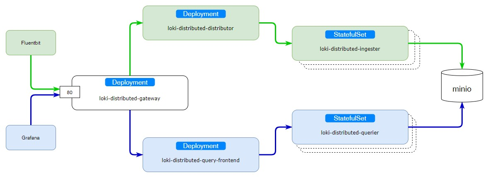

# Loki

За основу берем официальный [helm chart](https://github.com/grafana/helm-charts/tree/main/charts/loki-distributed)

Будем ставить версию loki-distributed - на каждую функцию отдельный микросервис.

Если не ожидается большой нагрузки на loki, можно ставить простой вариант, 
"[всё в одном](https://github.com/grafana/helm-charts/tree/main/charts/loki)"

    helm repo add grafana https://grafana.github.io/helm-charts
    helm repo update

    helm template loki grafana/loki-distributed -f values.yaml --namespace loki | \
    sed '/^#/d' | \
    sed '/helm.sh\/chart/d' | \
    sed '/chart: loki/d' | \
    sed '/heritage: Helm/d' | \
    sed '/managed-by: Helm/d' > manifests/loki.yaml

Установка в командной строке:

    kubectl create ns loki
    kubectl -n loki apply -f manifests/

Установка как приложение ArgoCD:

    kubectl -n loki apply -f argo-app/argo-app.yaml

## Видео

