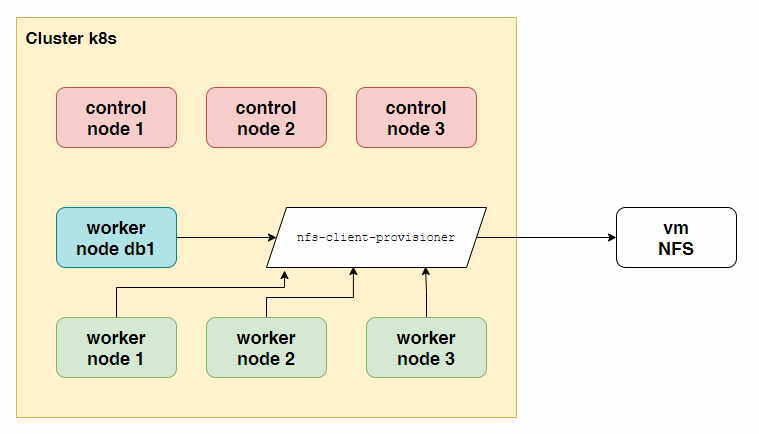
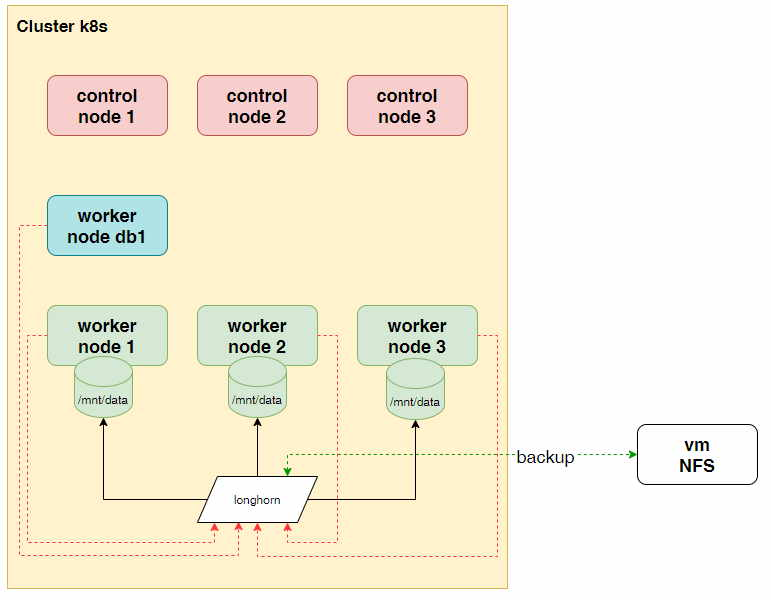

# Longhorn

[Документация](https://longhorn.io/).

Было:



Будет:



## Подготовка

Все дальнейшие действия рассчитаны на установку в мой кластер:

    # kubectl get nodes
    NAME                     STATUS   ROLES           AGE   VERSION
    control1.kryukov.local   Ready    control-plane   36m   v1.24.6
    control2.kryukov.local   Ready    control-plane   35m   v1.24.6
    control3.kryukov.local   Ready    control-plane   36m   v1.24.6
    db1.kryukov.local        Ready    <none>          35m   v1.24.6
    worker1.kryukov.local    Ready    <none>          35m   v1.24.6
    worker2.kryukov.local    Ready    <none>          35m   v1.24.6
    worker3.kryukov.local    Ready    <none>          35m   v1.24.6

К трём нодам (worker{1-3}) добавлены диски, смонтированные в /mnt/data. Эти
диски будет использовать Longhorn.

Скрипт [prepare.sh](prepare.sh) устанавливает базовые компоненты кластера на основании примера из [1.25](../1.25/).

```shell
./prepare.sh
```

Playbook [prepare_host.yaml](prepare_host.yaml) устанавливает необходимые для работы Longhorn компоненты.

```shell
ansible-playbook -i 00-ansible/hosts.yaml 00-ansible/prepare_host.yaml
```

## Установка по умолчанию.

```shell
helm repo add longhorn https://charts.longhorn.io
helm repo update
helm install longhorn longhorn/longhorn -n longhorn-system --create-namespace
```

Первый запуск будет долгим.

Добавим ingress с аутентификацией.

```shell
USER=admin; PASSWORD=password; echo "${USER}:$(openssl passwd -stdin -apr1 <<< ${PASSWORD})" 
```

Добавляем полученную строку в сикрет [00-basic-auth-secret.yaml](manifests/00-basic-auth-secret.yaml).

```shell
kubectl -n longhorn-system apply -f manifests/00-basic-auth-secret.yaml
kubectl -n longhorn-system apply -f manifests/01-ingress-ui.yaml
```

### Настройка томов в UI

Переходим в раздел `Node` -> `ExpandAll`

Установка longhorn по умолчанию, на всех воркер нодах создаёт тома, которые мы использовать не будем.
Поэтому мы отключим все тома по умолчанию.

Напомню, что на воркер нодах (worker{1-3}) добавлены диски, смонтированные в /mnt/data. Они предназначены для
использования в longhorn. 

Ноду db1 необходимо убрать из обслуживания. Поэтому ставим `Node Scheduling` в состояние `Disable`.

На всех нодах, в том числе и db1, удаляем диски по умолачнию. Для этого надо их перевести в состояние `Disable`, а
затем удалить.

Теперь расставим метки (tags) на ноды:
* worker1, worker2 - data
* worker2, worker3 - db

Предполагается, что на первых двух будут храниться файлы приложений (StorageClass data). На других файлы базы данных
(StorageClass db).

Добавим диски (директория /mnt/data), пометив диски меткой ssd. Так же зарезервируем на диске 0.5Gi места.

```shell
kubectl -n longhorn-system apply -f manifests/02-storage-class.yaml
```

### Используем

В качестве примера будем устанавливать postgresql и pgadmin. Используя разные тома longhorn. 

```shell
kubectl create ns postgresql
```
```shell
kubectl -n postgresql apply -f postgresql/postgreesql.yaml
```

```shell
kubectl -n postgresql apply -f postgresql/pgadmin.yaml
```

### Резервная копия.

Сначала необходимо добавить внешний диск, куда будет помещаться бэкап. Это может быть NFS или S3 хранилище.
У меня есть отдельная машина с NFS, будем использовать её.

Переходим в настройки: `Settings` -> `General` -> `BackupTarget`

    nfs://192.168.218.170:/var/nfs-disk/longhorn-back

Так же доступны снапшоты. Единственное замечание - восстановление из снапшота возможно только у отключённого тома.

## Немного автоматизации.

Небольшая автоматизация создания томов, что бы не настраивать их вручную, при помощи UI. 

Удалим то, что мы делали в предыдущем разделе: базу данных, pvc, storage classes.

```shell
kubectl -n postgresql delete -f postgresql
kubectl delete StorageClass data-db
kubectl delete StorageClass data
kubectl -n longhorn-system delete -f manifests/01-ingress-ui.yaml
kubectl -n longhorn-system delete -f manifests/00-basic-auth-secret.yaml
helm uninstall longhorn -n longhorn-system 
```

### Подготовка нод кластера

[Документаця](https://longhorn.io/docs/1.3.2/advanced-resources/default-disk-and-node-config/).

Пометим ноды кластера, диски которых будет использовать Longhorn.

```shell
kubectl annotate node worker1.kryukov.local node.longhorn.io/default-node-tags='["data"]'
kubectl annotate node worker2.kryukov.local node.longhorn.io/default-node-tags='["data","db"]'
kubectl annotate node worker3.kryukov.local node.longhorn.io/default-node-tags='["db"]'
kubectl label node worker1.kryukov.local node.longhorn.io/create-default-disk='config'
kubectl label node worker2.kryukov.local node.longhorn.io/create-default-disk='config'
kubectl label node worker3.kryukov.local node.longhorn.io/create-default-disk='config'
kubectl annotate node worker1.kryukov.local node.longhorn.io/default-disks-config='[{"name":"data","path":"/mnt/data","allowScheduling":true,"tags":["ssd"]}]'
kubectl annotate node worker2.kryukov.local node.longhorn.io/default-disks-config='[{"name":"data","path":"/mnt/data","allowScheduling":false,"tags":["ssd"]}]'
kubectl annotate node worker3.kryukov.local node.longhorn.io/default-disks-config='[{"name":"data","path":"/mnt/data","allowScheduling":true,"tags":["ssd"]}]'
```

На всякий пожарный, ниже команды удаляющие метки и аннотации.

```shell
kubectl annotate node worker1.kryukov.local node.longhorn.io/default-node-tags-
kubectl annotate node worker2.kryukov.local node.longhorn.io/default-node-tags-
kubectl annotate node worker3.kryukov.local node.longhorn.io/default-node-tags-
kubectl label node worker1.kryukov.local node.longhorn.io/create-default-disk-
kubectl label node worker2.kryukov.local node.longhorn.io/create-default-disk-
kubectl label node worker3.kryukov.local node.longhorn.io/create-default-disk-
kubectl annotate node worker1.kryukov.local node.longhorn.io/default-disks-config-
kubectl annotate node worker2.kryukov.local node.longhorn.io/default-disks-config-
kubectl annotate node worker3.kryukov.local node.longhorn.io/default-disks-config-
```

### Изменяем параметры по умолчанию

Создаём свой файл [values.yaml](values.yaml) для установки longhorn.

```shell
helm install longhorn longhorn/longhorn -n longhorn-system -f values.yaml --create-namespace
```

```shell
kubectl -n longhorn-system apply -f manifests/00-basic-auth-secret.yaml
kubectl -n longhorn-system apply -f manifests/01-ingress-ui.yaml
kubectl -n longhorn-system apply -f manifests/02-storage-class.yaml
```

```shell
kubectl create ns postgresql
kubectl -n postgresql apply -f postgresql
```

## Видео

* [Youtube](https://youtu.be/Q7SSlGnXOLY)
* [Telegram](https://t.me/arturkryukov/87)
* [VK](https://vk.com/video7111833_456239208)