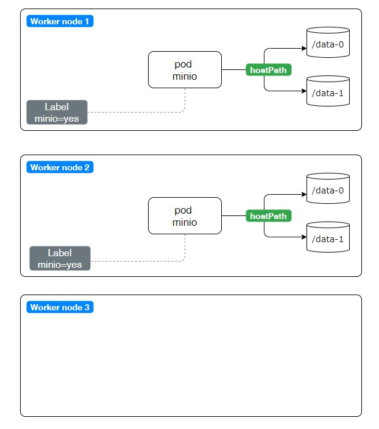

# Minio

_Основано на [Bitnami Object Storage Helm Chart based on MinIO](https://github.com/bitnami/charts/tree/master/bitnami/minio/#installing-the-chart)_



В качестве хранилища будет использоваться диски сервера. Поэтому необходимо жестко привязать
поды minio к соответствующим нодам кластера. Пометим две worker node при помощи label.

```shell
kubectl label nodes worker1.kryukov.local minio=yes
kubectl label nodes worker2.kryukov.local minio=yes
```

Добавляем репо helm chart-а:

```shell
helm repo add bitnami https://charts.bitnami.com/bitnami
```

Учитываем, что для нормальной работы minio должны быть 4 физических хранилища. Т.е. в 
нашем случае, на каждой ноде будет по два диска для minio.

Подготавливаем файл манифеста, который будет взять за основу:

```shell
helm template mi bitnami/minio -f values.yaml --namespace minio | \
sed '/^#/d' | \
sed '/helm.sh\/chart/d' | \
sed '/managed-by: Helm/d' > minio-in.yaml
```

Удаляем все что нам не надо из файла и копируем его в manifests/01-minio.yaml


## Установка

Ставим или руками или при помощи ArgoCD.

### kubectl

```shell
kubectl create ns minio
kubectl -n minio apply -f manifests/
```

### ArgoCD

Сначала создаём отдельный проект. Потом добавляем приложение.


```shell
kubectl apply -f argo-app/project.yaml
kubectl apply -f argo-app/argo-app.yaml
```

## WEB interface

Поскольку был установлен ingress, доступ к WEB интерфейсу:

http://minio.kryukov.local

## Видео

[](https://youtu.be/0MYrwR7EFBM)
