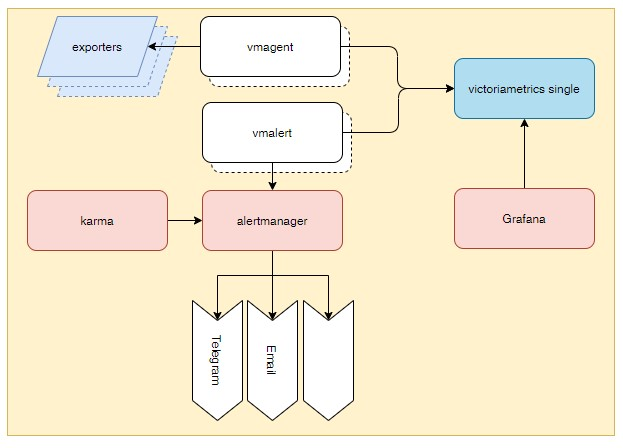

# Мониторинг

## Компоненты мониторинга.

* Exporters - разнообразные источники метрик в формате Prometheus. Метрики может отдавать непосредственно приложение, 
так и специально написанные для приложений экспортёры.
* Хранилище метрик создано на базе приложения [victoriametrics](https://docs.victoriametrics.com/Single-server-VictoriaMetrics.html).
Используем вариант victoriametrics single - один экземпляр приложения. Предназначен для небольших объемов и сроков 
хранения данных.
* [vmagent](https://docs.victoriametrics.com/vmagent.html) - приложение, собирающее метрики из экспортёров и помещающее 
их в хранилище метрик. Имеет возможность работать не только с экспортёрами метрик Prometheus, но и с другими системами
(Graphite, InfluxDB agent и т.д.). Может быть запущено несколько vmagent.
* [vmalert](https://docs.victoriametrics.com/vmalert.html) - Формирует алёрты на основании метрик, хранящихся в базе 
victoriametrics. Сгенерированные алёрты отправляет в alertmanager для дальнейшей обработки.
* [alertmanager](https://prometheus.io/docs/alerting/latest/alertmanager/) - обрабатывает алёрты, отправляемые 
клиентскими приложениями. Он заботится о дедупликации, группировке и маршрутизации алёртов к получателям. Также может 
выключать и запрещать алёрты.
* [karma](https://wiki.krlb.ru/display/ECP/2.22.4+Karma) - Приложение, формирующее дашборды на основании информации из 
alertmanager. Отображает текущие (не закрытые) алёрты. Позволяет гибко фильтровать информацию, основываясь на метках.
* [grafana](https://grafana.com/grafana/) - Приложение для создания дашбордов на основании различных источников данных. 
В том числе находящихся в victoriametrics.

## Эскпортёры.

### kube-state-metrics

[Документация](https://github.com/kubernetes/kube-state-metrics).

Предоставляет основную информацию о кластере kubernetes. Данные берёт из запросов к API kubernetes.

    helm repo add prometheus-community https://prometheus-community.github.io/helm-charts
    helm repo update
    helm install kube-state-metrics charts/ksm

[Application для ArgoCD](argo-app/01-ksm.yaml)
    
### node exporter

[Документация](https://github.com/prometheus/node_exporter).

Информация о Linux машинах.

    helm repo add prometheus-community https://prometheus-community.github.io/helm-charts
    helm repo update
    helm install node-exporter charts/nexporter

[Application для ArgoCD](argo-app/02-nexporter.yaml)

### Установка базового набора для сбора метрик

### Victoriametrics

    helm repo add vm https://victoriametrics.github.io/helm-charts/
    helm repo update
    helm install victoriametrics charts/vm -f charts/vm/my-values.yaml -n monitoring

[Application для ArgoCD](argo-app/03-victoriametrics.yaml)

### Vmagent

    helm repo add vm https://victoriametrics.github.io/helm-charts/
    helm repo update
    helm install vmagent charts/vmagent -f charts/vmagent/my-values.yaml -n monitoring

[Application для ArgoCD](argo-app/04-vmagent.yaml)

### Grafana

Пришлось отказаться от ingress из стандартного чарта. Он не поддерживает генерацию ingressClassName, только
соответствующую аннотацию.

Что бы не "лезть руками" в чарт grafana, добавил генерацию своего ingress. Это конечно костыли, но они работают.

[Helm chart](https://github.com/grafana/helm-charts)

    helm repo add grafana https://grafana.github.io/helm-charts
    helm repo update
    helm install grafana charts/grafana -f charts/grafana/my-values.yaml -n monitoring

[Application для ArgoCD](argo-app/05-grafana.yaml)

Пароль пользователя admin можно посмотреть в сикрете.

## Приложения обрабатывающие алёрты.

### alertmanager

[Helm chart](https://github.com/prometheus-community/helm-charts/tree/main/charts/alertmanager)

    helm repo add prometheus-community https://prometheus-community.github.io/helm-charts
    helm repo update
    helm install alertmanager charts/alertmanager -f charts/alertmanager/my-values.yaml -n monitoring

[Application для ArgoCD](argo-app/06-alertmanager.yaml)

Запускаем с минимальными настройками. Боле точно настроем его позднее, когда будем заниматься конкретными алёртами.

### vmalert

[Helm chart](https://github.com/VictoriaMetrics/helm-charts/tree/master/charts/victoria-metrics-alert)

    helm repo add vm https://victoriametrics.github.io/helm-charts/
    helm repo update
    helm install vmalert charts/vmalert -f charts/vmalert/my-values.yaml -n monitoring

[Application для ArgoCD](argo-app/07-vmalert.yaml)

Запускаем с одним настроенным алёртом. Иначе не запустится. Более точно будем настраивать позднее.

### karma

    helm repo add wiremind https://wiremind.github.io/wiremind-helm-charts
    helm repo update
    helm install karma charts/karma -f charts/karma/my-values.yaml -n monitoring

[Application для ArgoCD](argo-app/08-karma.yaml)

Тоже базовые настройки. Позднее будем тюнить.

## Видео

[Плейлист monitoring](https://www.youtube.com/playlist?list=PLmxqUDFl0XM6GecLZDgRvU3L0KOa-OQEh)

## Финальная версия.

[То, что должно получиться в итоге](final).