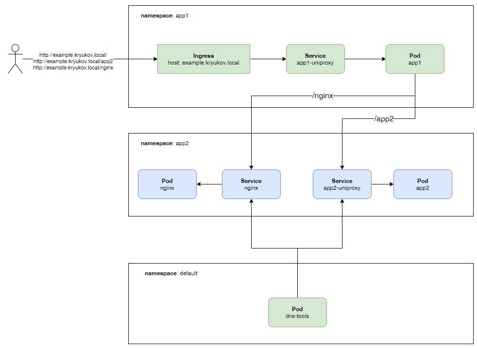

# Network Policies

[Сетевые политики](https://kubernetes.io/docs/concepts/services-networking/network-policies/) - аналог сетевого firewall.
Позволяют ограничивать сетевой трафик на уровне IP адресов и портов.

[Network Policies API](https://kubernetes.io/docs/reference/generated/kubernetes-api/v1.27/#networkpolicy-v1-networking-k8s-io).

## Теория

Объекты, которые можно использовать в сетевых политиках, определяются с помощью комбинации следующих 3-х идентификаторов:

* `podSelector` - поды.
* `namespaceSelector` - namespaces.
* `ipBlock` - блоки IP адресов.

При создании сетевой политики на основе пода или namespace используется labels для того, что бы определить
к каким или от каких подов или namespaces возможен трафик. Это похоже на использование selector у Service.

В kubernetes существует два типа изоляции пода: 

* `Egress` - исходящий сетевой трафик. 
* `Ingress` - входящий сетевой трафик.

По умолчанию не установлено никаких ограничений. Т.е. любой трафик от пода и к поду разрешён.

При включении Network Policies всегда будет разрешен локальный трафик пода (аналог localhost) и подключения,
определённые в политике.

Если определяется несколько сетевых политик - они объединяются. Сетевые политики не противоречат друг другу, а 
дополняют друг друга.

Чтобы разрешить подключение от исходного пода к целевому поду, необходимо разрешить подключение как в политике 
Egress в исходном поде, так и в политике Ingress в целевой поде.

## Тестовый стенд

Для демонстрации работы сетевых политик будет использовано приложение [uniproxy](../../Utils/uniproxy).



```shell
kubectl apply -f argoapp/01.yaml -f argoapp/02.yaml -f argoapp/03.yaml
```

## Ingress

По умолчанию доступ к приложению открыт:

```shell
curl -s http://example.kryukov.local | jq
```

```shell
curl -s http://example.kryukov.local/app2 | jq
```

```shell
curl -s http://example.kryukov.local/nginx | jq
```

### Deny All

В namespace app2 запретим весь входящий трафик.

```yaml
kind: NetworkPolicy
apiVersion: networking.k8s.io/v1
metadata:
  name: default-deny-all
  namespace: app2
spec:
  policyTypes:
  - Ingress
  podSelector: {}
  ingress: []
```

* `namespace: app2` определяет namespace, к подам которого будет применяться сетевая политика.
* `podSelector` пуст. Это означает, что он будет соответствовать всем подам. Таким образом, политика будет применена 
  ко всем подам в namespace app2.
* `ingress` пустой массив. Поскольку правила отбора трафика не указаны, по умолчанию запрещается весь трафик к подам, 
  выбранным при помощи `podSelector`. 

```shell
kubectl apply -f np/np-01.yaml
```

```shell
kubectl -n app2 get networkpolicies
```

Проверим, что выдаст приложение.

```shell
curl -s http://example.kryukov.local/app2 | jq
```

После задержки, вызванной невозможностью из app1 получить доступ к приложениям в namespace app2, поучим сообщение об 
ошибке:

```json
{
  "comment": "App2",
  "namespace": "app1",
  "path": "/app2",
  "podName": "app1-uniproxy-684d85f6f6-llf9l",
  "proxyPath": "http://app2-uniproxy.app2.svc",
  "returnMessage": {
    "Op": "Get",
    "URL": "http://app2-uniproxy.app2.svc",
    "Err": {
      "Op": "dial",
      "Net": "tcp",
      "Source": null,
      "Addr": {
        "IP": "10.233.38.16",
        "Port": 80,
        "Zone": ""
      },
      "Err": {}
    }
  }
}
```

### Разрешение подключения из namespace

Если мы хотим оставить политику по умолчанию deny + разрешить доступ из определенного namespace (app1). Нам потребуется
добавить еще одну сетевую политику в namespace app2.

```yaml
kind: NetworkPolicy
apiVersion: networking.k8s.io/v1
metadata:
  name: allow-from-ns-app1
  namespace: app2
spec:
  policyTypes:
  - Ingress
  podSelector:
    matchLabels:
      app.kubernetes.io/instance: app1
  ingress:
    - from:
      - namespaceSelector:
          matchLabels:
            kubernetes.io/metadata.name: app1
        podSelector: 
          matchLabels:
            app.kubernetes.io/instance: app1
```

В это политике мы:

* В `podSelector` при помощи `matchLabels` указываем поды для которых будет работать сетевые правила.
* В `ingress` определяем правила для входящего трафика.

Подробнее про `ingress`. В массиве `from` определяются два условия:

* `namespaceSelector` - из какого namespace разрешен трафик
* `podSelector` - из каких подов namespace разрешен трафик

Оба условия объединяются логическим AND.

> Важное замечание по поводу AND и OR.

> Это AND:
```yaml
- from:
  - namespaceSelector:
      matchLabels:
        kubernetes.io/metadata.name: app1
    podSelector: 
      matchLabels:
        app.kubernetes.io/instance: app1
```

> Это OR:

```yaml
- from:
  - namespaceSelector:
      matchLabels:
        kubernetes.io/metadata.name: app1
  - podSelector: 
      matchLabels:
        app.kubernetes.io/instance: app1
```

Применим сетевую политику:

```shell
kubectl apply -f np/np-02.yaml
```

Проверим, что выдаст наше приложение.

```shell
curl -s http://example.kryukov.local/app2 | jq
```

Запустим приложение в namespace default:

```shell
kubectl run -it --rm --restart=Never --image=infoblox/dnstools:latest dnstools
```

Сначала пошлем запрос к приложению app1, что бы убедиться, что все работает:

>    curl -s http://app1-uniproxy.app1.svc

К app1 но по контексту `/app2`:

>    curl -s http://app1-uniproxy.app1.svc/app2

Затем пошлем запрос к приложению app2.

>    curl http://app2-uniproxy.app2.svc --connect-timeout 5

Потом к nginx.

>    curl -s http://nginx.app2.svc --connect-timeout 5

Таким образом мы убедились, что наши политики работают.

Удалим политику `default-deny-all`:

```shell
kubectl delete -f np/np-01.yaml
```

Повторим попытку доступа к app2 из пода в namespace default:

>    curl http://app2-uniproxy.app2.svc --connect-timeout 5

Теперь к nginx:

>    curl -s http://nginx.app2.svc --connect-timeout 5

Можно сделать вывод: Если к поду подключена какая-либо сетевая политика, доступ к нему становится по умолчанию: "всё
запрещено, разрешено только то, что разрешено".

Вернем обратно политику по умолчанию для namespace app2:

```shell
kubectl apply -f np/np-01.yaml
```

### Две сетевых политики

Добавим разрешение доступа к приложению app2 из namespace default:

```yaml
kind: NetworkPolicy
apiVersion: networking.k8s.io/v1
metadata:
  name: allow-from-ns-default
  namespace: app2
spec:
  policyTypes:
  - Ingress
  podSelector: {}
  ingress:
    - from:
      - namespaceSelector:
          matchLabels:
            kubernetes.io/metadata.name: default
        podSelector: {}
```

```shell
kubectl apply -f np/np-03.yaml
```

Затем пошлем запрос к приложению app2 напрямую и через app1.

>    curl -s http://app2-uniproxy.app2.svc

>    curl -s http://app1-uniproxy.app1.svc/app2

>    curl -s http://nginx.app2.svc

Удалим политику `allow-from-ns-app1`

```shell
kubectl delete -f np/np-02.yaml
```

Повторим запросы:

>    curl -s http://app2-uniproxy.app2.svc

>    curl -s http://app1-uniproxy.app1.svc/app2

>    curl -s http://nginx.app2.svc

В результате удаления политики приложение app1 из namespace app1 потеряло доступ к подам namespace app2. А приложение
из namespace default доступ сохранило.

Удалим политику `allow-from-ns-default`

```shell
kubectl delete -f np/np-03.yaml
```

### Два правила в одной политике

В принципе можно правила из политик `allow-from-ns-app1` и `allow-from-ns-default` описать в одной политике.

```yaml
kind: NetworkPolicy
apiVersion: networking.k8s.io/v1
metadata:
  name: allow-from-ns-app1-and-default
  namespace: app2
spec:
  policyTypes:
    - Ingress
  podSelector: {}
  ingress:
    - from:
        - namespaceSelector:
            matchLabels:
              kubernetes.io/metadata.name: app1
          podSelector:
            matchLabels:
              app.kubernetes.io/instance: app1
        - namespaceSelector:
            matchLabels:
              kubernetes.io/metadata.name: default
          podSelector: {}
```

В `from` при указываем два правила. Поскольку это два элемента массива, они объединяются логическим OR.

Но тут придется пожертвовать `podSelector`. В этом варианте политика будет применяться ко всем подам в namespace app2. 

Убедимся, что в namespace app2 осталась только политика `default-deny-all`:

```shell
kubectl -n app2 get networkpolicies
```

Добавим политику `allow-from-ns-app1-and-default`:

```shell
kubectl apply -f np/np-04.yaml
```

Повторим запросы:

>    curl -s http://app2-uniproxy.app2.svc

>    curl -s http://app1-uniproxy.app1.svc/app2

>    curl -s http://nginx.app2.svc

### Разрешение доступа на конкретный порт пода

Если необходимо открывать доступ к определённым портам пода, можно немного модифицировать предыдущую сетевую политику:

```yaml
kind: NetworkPolicy
apiVersion: networking.k8s.io/v1
metadata:
  name: allow-from-ns-app1-and-default
  namespace: app2
spec:
  policyTypes:
    - Ingress
  podSelector: {}
  ingress:
    - ports:
        - port: 8080
          protocol: TCP
    - from:
      - namespaceSelector:
          matchLabels:
            kubernetes.io/metadata.name: app1
        podSelector:
          matchLabels:
            app.kubernetes.io/instance: app1
      - namespaceSelector:
          matchLabels:
            kubernetes.io/metadata.name: default
        podSelector: {}
```

В ней в секции `ingress` был добавлен раздел `ports`, в котором мы можем перечислять порты пода.
 
**Обратите внимание, что мы управляем портами пода, а не сервиса!** В NetworkPolices мы не можем использовать сервисы
для описания правил!
 
В политиках при помощи `endPort` можно указывать диапазон портов:

```yaml
    - ports:
        - protocol: TCP
          port: 30000
          endPort: 32000
```

## Правила Egress

В качестве примера в namespace app1 разрешим всем подам исходящий трафик только в namespace app2.

*В сетевой политике вместо `matchLabels` показан пример использования `matchExpressions`*.

```yaml
kind: NetworkPolicy
apiVersion: networking.k8s.io/v1
metadata:
  name: allow-to-ns-app2
  namespace: app1
spec:
  policyTypes:
    - Egress
  podSelector: {}
  egress:
  - to:
    - namespaceSelector:
        matchExpressions:
        - key: kubernetes.io/metadata.name
          operator: In
          values:
            - app2
            - some_label 
```

Применим сетевую политику:

```shell
kubectl apply -f np/np-05.yaml
```

Удалим все сетевые политики из namespace app2. Если они там остались.

Попробуем подключиться из приложения app1 к app2:

```shell
curl -s http://example.kryukov.local/app2 | jq
```

В результате ничего не получилось. К сожалению приложение uniproxy в ответе не показывает причину ошибки.
На самом деле ошибка: `Resolving timed out`. Проблема в доступе к DNS серверу кубера. Определив политику для исходящего
трафика мы закрыли исходящий трафик от пода к DNS.

Добавим вторую политику, разрешающую доступ к DNS:

```yaml
kind: NetworkPolicy
apiVersion: networking.k8s.io/v1
metadata:
  name: allow-to-kubedns
  namespace: app1
spec:
  policyTypes:
    - Egress
  podSelector: {}
  egress:
    - to:
      - ipBlock:
          cidr: 169.254.25.10/32
      ports:
        - port: 53
          protocol: UDP
        - port: 53
          protocol: TCP
```

**Обратите внимание на то, что в моем кластере кубера используется nodelocaldns, приземлённый на IP адрес на
каждой ноде кластера!** Пример другого способа определения доступа к DNS северу можно посмотреть в 
[np-07.yaml](np/np-07.yaml).

Применим сетевую политику:

```shell
kubectl apply -f np/np-06.yaml
```

Попробуем подключиться из приложения app1 к app2:

```shell
curl -s http://example.kryukov.local/app2 | jq
```

## Видео

* [VK](https://vk.com/video7111833_456239248)
* [Telegramm](https://t.me/arturkryukov/325)
* [Rutube](https://rutube.ru/video/5e50f983f13ddc987ee04f8e595de971/)
* [Zen](https://dzen.ru/video/watch/6503f46ecf85cb3a1cfda3a1)
* [Youtube](https://youtu.be/1ACDqnfGdIQ)