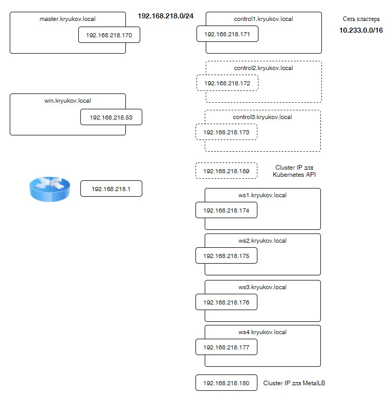

# Host Endpoint

[HostEndpoints](https://docs.tigera.io/calico/latest/reference/host-endpoints/).

Calico позволяет ограничивать трафик не только внутри кластера kubernetes, но и
на сетевых интерфейсах хоста. Т.е. при помощи calico можно построить почти полноценный
firewall, без использования firewalld и похожих инструментов.

Для того, что бы сетевые политики calico могли применяться к сетевым интерфейсам хоста
необходимо определить HostEndpoint, описывающие эти интерфейсы.

## Failsafe rules

**Важно!** *Как только вы определяете HostEndpoint для интерфейса, автоматически к этому
интерфейсу применяется правило Deny All. Поэтому сначала определите сетевую политику,
использующую селекторы ссылающиеся на HostEndpoint. И только потом создавайте HostEndpoint.*

Разработчики calico встроили в систему защиту от дурака. А именно - определили порты, которые 
нельзя закрыть. Список портов по умолчанию можно 
[найти тут](https://docs.tigera.io/calico/latest/reference/host-endpoints/failsafe).

Т.е. какие бы вы не добавляли HostEndpoint, какие бы NetworkPolices вы на них не вешали.
Эти порты всегда будут открыты.

Эту защиту можно отключить, изменит или расширить. Это делается при помощи параметров
`FailsafeInboundHostPorts` и `FailsafeOutboundHostPorts` в `kind: FelixConfiguration`.

Например `FailsafeInboundHostPorts: ["none"]` - выключает защиту портов для входящего трафика.

Изменить список портов можно явно определив этот список в `kind: FelixConfiguration`:

```yaml
apiVersion: projectcalico.org/v3
kind: FelixConfiguration
metadata:
  name: default
spec:
  bpfLogLevel: ''
  floatingIPs: Disabled
  healthPort: 9099
  logSeverityScreen: Info
  reportingInterval: 0s
  failsafeInboundHostPorts:
    - "tcp:22"
    - "udp:68"
    - "tcp:179"
    - "tcp:2379"
    - "tcp:2380"
    - "tcp:6443"
    - "tcp:6666"
    - "tcp:6667"
```

## apiVersion

`apiVersion: crd.projectcalico.org/v1` vs `apiVersion: projectcalico.org/v3`!

Если вы пользуетесь Lens. И смотрите исходники манифестов проекта calico. Lens почему то
у манифестов показывает `apiVersion: crd.projectcalico.org/v1`. Хотя разработчики
явно описывают в crd и своей документации, что необходимо использовать `apiVersion: projectcalico.org/v3`.

Я несколько раз забывал про этот "трюк" Lens. Хотя все будет работать и с `apiVersion: crd.projectcalico.org/v1`.
Но разработчики рекомендуют - значит мы должны использовать то, что они рекомендуют.

## Определение HostEndpoint

Calico предоставляет возможность автоматически создавать HostEndpoint для интерфейсов.
Но там где есть автоматика, там могут возникать не предвиденные ситуации. Поэтому я ограничусь
ссылкой на пример в 
[документации](https://docs.tigera.io/calico/latest/network-policy/hosts/kubernetes-nodes#enable-automatic-host-endpoints), 
где показано как эту опцию включить. А вы уже дальше на свой страх и риск...

Типичный пример определения HEP (HostEndpoint):

```yaml
apiVersion: projectcalico.org/v3
kind: HostEndpoint
metadata:
  name: <name of endpoint>
  labels:
    role: webserver
    environment: production
spec:
  interfaceName: eth0
  node: <node name or hostname>
  expectedIPs: ["10.0.0.1"]
```

Думаю не стоит описывать каждый параметр. Их назначение понятно из названия. Приведу пример
описания HEP для контрол ноды моего кластера:

```yaml
apiVersion: projectcalico.org/v3
kind: HostEndpoint
metadata:
  name: control1-ens160
  labels:
    node-endpoint: home
    node-role: control
spec:
  interfaceName: ens160
  node: control1.kryukov.local
  expectedIPs:
    - 192.168.218.171
```

Все HEP для кластера описаны в файле [cluster-heps.yaml](hep/cluster-heps.yaml).

## Firewall

Теперь посмотрим как при помощи HEP и GlobalNetworkPolicy организовать простейший firewall
для нашего кластера.

### preDNAT и applyOnForward

Что бы понять о чём пойдет речь, посмотрим на схему из документации calico.


Для фильтрации трафика нам нужно ловить пакеты:

- на входе сетевого интерфейса хоста. Причем до того как к нему будут применены действия по замене
  IP и портов. Т.е. перед DNAT.
- на цепочке FORWARD. Т.е. трафик проходящий через наш хост на другие машины в сети.

Первое условие определяется при помощи параметра `preDNAT` в описании GlobalNetworkPolicy.
Мы сможем в политике фильтровать пакеты "на входе". Например, фильтровать порты сервисов типа NodePort.
Или трафик к локальным приложениям сервера, не относящимся к кластеру kubernetes.

Если копнуть глубже, то выглядит это как то так:

```
# iptables -t raw -L -n

Chain cali-PREROUTING (1 references)
target     prot opt source               destination
MARK       all  --  0.0.0.0/0            0.0.0.0/0            /* cali:XFX5xbM8B9qR10JG */ MARK and 0xfff0ffff
MARK       all  --  0.0.0.0/0            0.0.0.0/0            /* cali:EWMPb0zVROM-woQp */ MARK or 0x40000
cali-rpf-skip  all  --  0.0.0.0/0            0.0.0.0/0            /* cali:PWuxTAIaFCtsg5Qa */ mark match 0x40000/0x40000
DROP       all  --  0.0.0.0/0            0.0.0.0/0            /* cali:fSSbGND7dgyemWU7 */ mark match 0x40000/0x40000 rpfilter validmark invert
cali-from-host-endpoint  all  --  0.0.0.0/0            0.0.0.0/0            /* cali:ImU0-4Rl2WoOI9Ou */ mark match 0x0/0x40000
ACCEPT     all  --  0.0.0.0/0            0.0.0.0/0            /* cali:lV4V2MPoMBf0hl9T */ mark match 0x10000/0x10000
```

```
# iptables -t mangle -L -n

Chain cali-PREROUTING (1 references)
target     prot opt source               destination
ACCEPT     all  --  0.0.0.0/0            0.0.0.0/0            /* cali:6BJqBjBC7crtA-7- */ ctstate RELATED,ESTABLISHED
ACCEPT     all  --  0.0.0.0/0            0.0.0.0/0            /* cali:KX7AGNd6rMcDUai6 */ mark match 0x10000/0x10000
cali-from-host-endpoint  all  --  0.0.0.0/0            0.0.0.0/0            /* cali:wNH7KsA3ILKJBsY9 */
ACCEPT     all  --  0.0.0.0/0            0.0.0.0/0            /* cali:Cg96MgVuoPm7UMRo */ /* Host endpoint policy accepted packet. */ mark match 0x10000/0x10000
```

`cali-from-host-endpoint` - где то тут будут находиться правила, формируемые политиками с включенными `preDNAT`.

**Важно!** *После включения `preDNAT` в политике перестаёт работать правило denyAll по умолчанию. Запрещать 
прохождение пакетов необходимо явным образом.*

Для включения второго условия используется параметр `applyOnForward`.

Каждый под в сетевом стеке хоста представлен отдельным сетевым интерфейсом. В случае calico имя интерфейса
будет начинаться с `cali`. Трафик перенаправялемый в под - это транзитный трафик и он проходит
через цепочку FORWARD таблицы filter пакетного фильтра Linux. Таким образом, включая `applyOnForward` в 
сетевой политике, мы применяем её правила к транзитным пакетам. И они срабатывают раньше, чем правила
обычных политик, на схеме обозначенных как `Workload-n policy`.

### ТЗ

Сначала сформулируем задачу, что должен закрывать наш firewall.



- Разрешить весь входящий и исходящий трафик:
  - для сети кластера kubernetes. В моем случае это `10.233.0.0/16`.
  - для хостов кластера. В моём случае это будет не сеть, а перечисление IP отдельных хостов.
  - весь исходящий трафик для всех.
- Разрешить трафик на loopback interface хостов кластера.
- В кластере используются два кластерных IP: 
  - 192.168.218.180 - разрешить подключаться на tcp/80 и tcp/443
  - 192.168.218.189 - разрешить подключаться на tcp/7443. *По хорошему этот порт надо добавить в исключения в 
    `kind: FelixConfiguration`*
- Разрешить входящий трафик только на определённые сервисы типа NodePort. 

### Разрешить весь входящий и исходящий трафик

Начнём с сети кластера kubernetes. В моем случае в кластере используется сеть 10.233.0.0/16. И для подов и для сервисов.

Глобальная сетевая политика будет выглядеть так:

```yaml
apiVersion: projectcalico.org/v3
kind: GlobalNetworkPolicy
metadata:
  name: default-rules
spec:
  selector: node-endpoint == 'home'
  order: 20
  preDNAT: true
  applyOnForward: true
  types:
    - Ingress
  ingress:
    - action: Allow
      source:
        nets:
          - 10.233.0.0/16
    - action: Deny
```

- `selector: node-endpoint == 'home'` - тыт мы указываем labels, которые ставили на HostEnpoint. Т.е. политика
будет применяться только к тем интерфейсам хостов кластера, которые поределены при помощи HostEnpoint.
- `order: 20` - начинаем использовать приоритеты. Эта политика планируется как политика по умолчанию. Она
  будет выполняться в самом конце, после того как сработают другие политики. Поэтому ставлю ей меньший приоритет.
- `preDNAT: true` и `applyOnForward: true` - для чего это используется было описано ранее.
- `types: [ Ingress ]` - в политике будут описаны только правила Ingress.
- `- action: Allow` - разрешаем хождения пакетов из сети кластера.
- `- action: Deny` - Явно запрещаем все остальные пакеты.

Напомню, что при включении `preDNAT: true` нам явно надо писать правило Deny All в конце.

Исходящий трафик разрешаем в другой политике.

```yaml
apiVersion: projectcalico.org/v3
kind: GlobalNetworkPolicy
metadata:
  name: allow-outbound-external
spec:
  order: 20
  selector: node-endpoint == 'home'
  types:
    - Egress
  egress:
    - action: Allow
```

Теперь добавим разрешение для IP адресов хостов машин кластера kubernetes.

Тут есть два варианта.

#### Вариант 1

Если в HostEndpoint не указан IP адрес хоста.

```yaml
apiVersion: projectcalico.org/v3
kind: HostEndpoint
metadata:
  name: control1-ens160
  labels:
    node-endpoint: home
    node-role: control
spec:
  interfaceName: ens160
  node: control1.kryukov.local
```

Тогда первая политика будет выглядеть так:

```yaml
apiVersion: projectcalico.org/v3
kind: GlobalNetworkPolicy
metadata:
  name: default-rules
spec:
  selector: node-endpoint == 'home'
  order: 20
  preDNAT: true
  applyOnForward: true
  types:
    - Ingress
  ingress:
    - action: Allow
      source:
        nets:
          - 10.233.0.0/16
          - 192.168.218.171/32
          - 192.168.218.174/32
          - 192.168.218.175/32
          - 192.168.218.176/32
          - 192.168.218.177/32
    - action: Deny
```

Мы просто добавляем IP адреса машин в список разрешенных.

#### Вариант 2

Если в HostEnpoint указан IP адрес.

```yaml
apiVersion: projectcalico.org/v3
kind: HostEndpoint
metadata:
  name: control1-ens160
  labels:
    node-endpoint: home
    node-role: control
spec:
  interfaceName: ens160
  node: control1.kryukov.local
  expectedIPs:
    - 192.168.218.171
```

Тогда в политике нет необходимости явным образом перечислять IP сетевых интерфейсов. Достаточно указать
HostEnpoints. Calico из них возьмет необходимые IP для создания правила. Политика будет выглядеть
следующим образом:

```yaml
apiVersion: projectcalico.org/v3
kind: GlobalNetworkPolicy
metadata:
  name: default-rules
spec:
  selector: node-endpoint == 'home'
  order: 20
  preDNAT: true
  applyOnForward: true
  types:
    - Ingress
  ingress:
    - action: Allow
      source:
        nets:
          - 10.233.0.0/16
    - action: Allow
      source:
        selector: node-endpoint == 'home'
    - action: Deny
```

Мы добавили еще один Allow с использованием селектора.

### Разрешить трафик на loopback interface хостов кластера

Это просто. Добавим еще одно правило в существующую политику.

```yaml
    - action: Allow
      destination:
        nets:
          - 127.0.0.0/8
```

### Кластерные IP адреса.

У меня в кластере есть MetalLB и кластерный IP используемый в сервисе типа LoadBalancer ingress контроллера -
192.168.218.180. На этом IP необходимо открыть порты 80 и 443.

Для доступа к kubernetes API через HA Proxy я использую IP 192.168.218.189 и порт 7443.

Эти IP адреса не указаны ни в одном HostEndpoint

Для доступа к этим ресурсам напишем отдельную политику, с большим приоритетом:

```yaml
apiVersion: projectcalico.org/v3
kind: GlobalNetworkPolicy
metadata:
  name: allow-rules
spec:
  selector: node-endpoint == 'home'
  order: 10
  preDNAT: true
  applyOnForward: true
  types:
    - Ingress
  ingress:
    - action: Allow
      destination:
        nets:
          - 192.168.218.180/32
        ports:
          - 80
          - 443
      protocol: TCP
    - action: Allow
      destination:
        nets:
          - 192.168.218.189/32
        ports:
          - 7443
      protocol: TCP
```

### Разрешить входящий трафик только на определённые сервисы типа NodePort

Тут меня ждало фиаско. В документации calico есть 
[пример](https://docs.tigera.io/calico/latest/network-policy/services/kubernetes-node-ports#allow-ingress-traffic-to-specific-node-ports), 
как разрешать доступ к сервисам NodePort. Но он не работает.

**По умолчанию все NodePort открыты.**

Сначала я подумал, что диапазон портов входит в список защищенных портов. Явно переопределил конфигурацию felix,
исключив из списка диапазон NodePort кластера. Не помогло.

[Задал вопрос](https://github.com/projectcalico/calico/issues/8109) разработчикам calico. Ждал ответа недели две.
В итоге принял решение снять видео так как есть. Надеюсь, когда вы смотрите это видео от разработчиков поступит
ответ, что я делал не так.

## Видео

* [VK](https://vk.com/video7111833_456239253)
* [Rutube](https://rutube.ru/video/c31360c9854ae30976d7c2b51200971f/)
* [Zen](https://dzen.ru/video/watch/6560735ac55cb406db4a20d4)
* [Youtube](https://youtu.be/5g2cnLvgjq8)