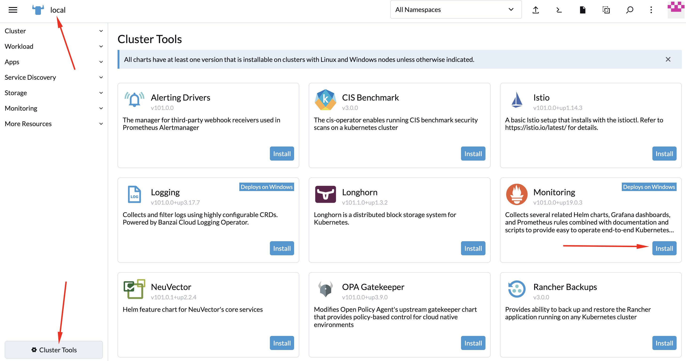
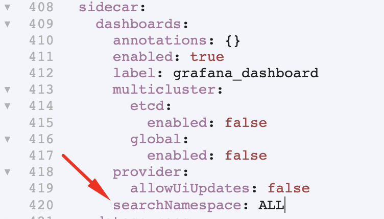
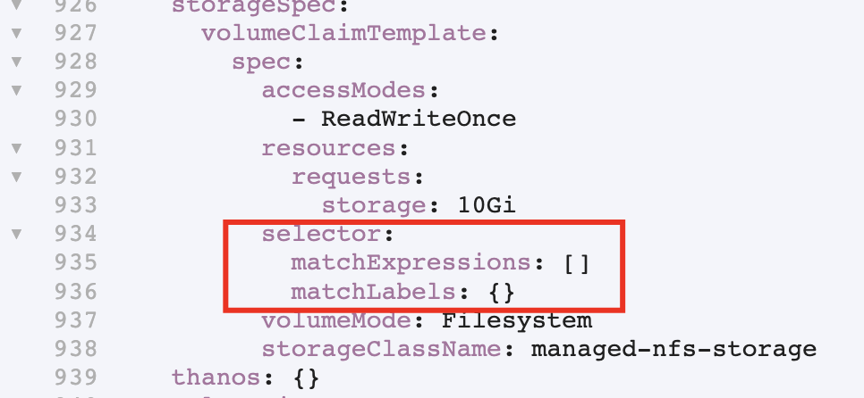
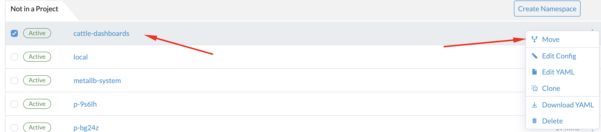

# Мониторинг в Rancher

В Rancher для организации мониторинга используется проект 
[kube-prometheus](https://github.com/prometheus-operator/kube-prometheus).

## Установка основного набора приложений мониторинга.

Установить и управлять этими приложениями имеет право только администратор rancher или администратор 
соответствующего кластера.

Вы можете разрешить другим пользователям добавлять правила сбора метрик, добавление дополнительных dashboards
в grafana и конфигурацию alertmanager, при помощи добавления разрешения доступа к проекту в котором будет
установлен этот софт.

1. Выберите кластер в котором будет установлен мониторинг.
2. Создайте проект `Monitoring`.
3. В левом нижнем углу нажмите кнопку `Cluster Tools`.
4. В разделе `Monitoring` нажмите кнопку `Install`.



5. `Install into Project` -> `Monitoring`
6. Установите чекбокс `Customize Helm options befor install`. 
7. Нажмите кнопку `Next`. 
8. В секции `Prometheus` установите необходимые значения в полях ввода. 
9. Если для хранения метрик будут использовать PV, установите чекбокс `Persistent Sorage for Prometheus` и
   заполните необходимые поля.
10. Нажмите кнопку `Edit YAML`.

Если вы хотите разрешить добавлять dashboards в grafana из других namespaces, выполните следующий пункт.

11. Найдите ветку `grafana.sidecar.dashboards.searchNamespace` и в качестве значения поставьте `ALL`.



12. Если при установке системы не удаётся выделить PV, попробуйте удалить выделенные строки.



13. Нажмите кнопку `Next`.
14. Нажмите кнопку `Install` и дождитесь завершения установки.

В результате в проекте `Monitoring` будет создан namespace `cattle-monitoring-system` в котором будут запущены 
все приложения системы мониторинга.

Добавьте namespace `cattle-dashboards` в проект `Monitoring`.



## Добавление мониторинга ETCD кластера.

В моем случае кластер устанавливался не при помощи rancher. И rancher ничего не знает про etcd. Поэтому надо немного
продрихтовать систему мониторинга.

Сначала посмотрим как запускается etcd. 

```shell
cat /etc/kubernetes/manifests/etcd.yaml
```

Т.е. на каждой control ноде etcd будет доступен на ip адресе ноды.

Сертификаты для доступа к etcd смотрим тут.

```shell
ls /etc/kubernetes/pki/etcd/
```

Нас интересуют сертификат CA, а так же сертификат и ключ клиента.

Проверим, доступны ли нам метрики с этими сертификатами.

```shell
curl -v https://192.168.218.171:2379/metrics \
--cacert /etc/kubernetes/pki/etcd/ca.crt \
--cert /etc/kubernetes/pki/etcd/healthcheck-client.crt \
--key /etc/kubernetes/pki/etcd/healthcheck-client.key
```

Создадим secret в namespace kube-system

```shell
kubectl -n kube-system create secret generic kube-etcd-client-certs \
--from-file=etcd-client-ca.crt=/etc/kubernetes/pki/etcd/ca.crt \
--from-file=etcd-client.crt=/etc/kubernetes/pki/etcd/healthcheck-client.crt \
--from-file=etcd-client.key=/etc/kubernetes/pki/etcd/healthcheck-client.key
```

[Документация по ServiceMonitor](https://github.com/prometheus-operator/prometheus-operator/blob/main/example/prometheus-operator-crd-full/monitoring.coreos.com_servicemonitors.yaml)

Добавляем Service, Endpoint и ServiceMonitor.

```shell
kubectl apply -f manifests/etcd-metrics.yaml
```

Через некоторое время смотрим targets в prometheus. Еще через пару минут смотрим в web интерфесе раздела кластер
метрики etcd.

## Видео

* Youtube: https://youtu.be/bVzMOMJNb-s
* VK: https://vk.com/video7111833_456239229
* Telegramm: https://t.me/arturkryukov/167

Плейлист цикла по rancher: 

* Youtube: https://www.youtube.com/playlist?list=PLmxqUDFl0XM5x96wHJbBGeqNB1vhKfVv9
* VK: https://vk.com/video/playlist/7111833_5
* Rutube: https://rutube.ru/plst/265514/