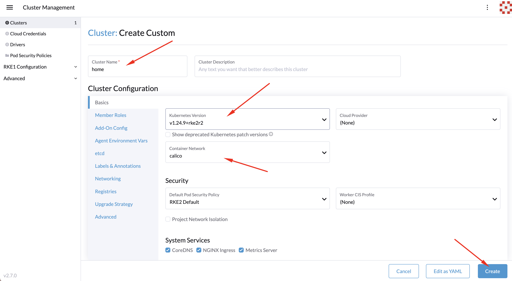
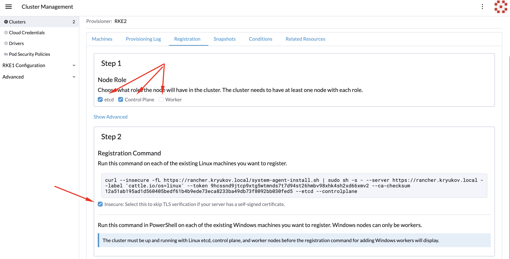
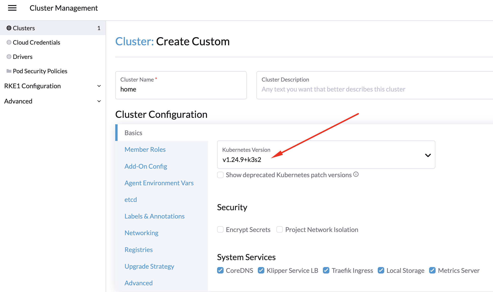
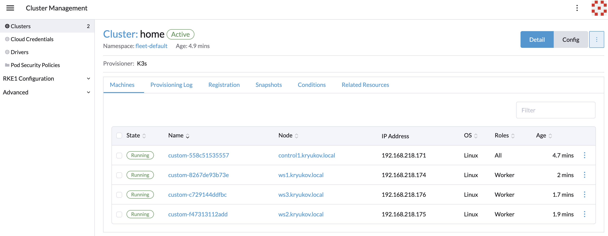

# Rancher

https://www.rancher.com/products/rancher

Последняя версия rancher на момент написания данного документа - v2.7.x

Поддерживаемые операционные системы и версии кластеров kubernetes: 
https://www.suse.com/suse-rancher/support-matrix/all-supported-versions/rancher-v2-7-0/

Сначала мы поставим rancher в докер, что бы посмотреть, как можно при помощи rancher устанавливать другие
кластера kubernetes.

Затем всё снесём, поставим обычный vanilla кластер kubernetes в который установим rancher. И уже в этой
инсталляции подробнее посмотрим возможности rancher.

## docker контейнер

Если говорить про установку в docker, надо понимать, что мы получаем конструкцию типа "матрёшки" состоящую
из 3-х слоёв.

* docker контейнер.
* k3s кластер, который запускается внутри контейнера.
* rancher, который запускается в k3s кластере.

Судя по документации, для запуска rancher надо поступать как то так.

```shell
mkdir -p /var/log/rancher/
mkdir /opt/rancher

docker run -d --restart=unless-stopped --name rancher-270 \
  -p 8080:80 -p 8443:443 \
  -v /var/log/rancher/auditlog:/var/log/auditlog \
  -v /opt/rancher:/var/lib/rancher \
  --privileged \
  rancher/rancher:v2.7.0
```

Но оно не работает. Не страшно, с rancher это случается регулярно. 

Попробуем зайти с другой стороны. Если не работает k3s внутри docker, запустим k3s без прослоек.

## k3s 

K3s удобная альтернатива, способная заменить docker в части запуска контейнеров и их управления.

_Если до этого на машине был установлен docker - удалите его. Нам не нужны две системы контейнеризации._

K3s будем ставить в режиме одной ноды. 
При установке обязательно указываем версию k3s, иначе может быть установлена версия не поддерживаемая
rancher. На момент написания данного руководства rancher не мог работать с kubernetes >= 1.25.0. 

```shell
curl -sfL https://get.k3s.io | INSTALL_K3S_VERSION=v1.24.9+k3s2 sh -
```

Обязательно ставим cert-manager. Без него rancher работать не будет. Создадим namespace.

```shell
kubectl apply -f https://github.com/cert-manager/cert-manager/releases/download/v1.9.1/cert-manager.yaml
kubectl create namespace cattle-system
```

В k3s по умолчанию "встроен" helm. Поэтому достаточно запушить в кластер 
этот манифест [chart-for-k3s.yaml](chart-for-k3s.yaml).

```shell
kubectl apply -f chart-for-k3s.yaml
```

Смотрим как устанавливается rancher.

```shellwatch 
watch kubectl get pods -A
```

Запускается pod `helm-install-rancher-*`. Ждём когда он перейдёт в состояние `Completed`.

### Создание нового кластера

В основном меню выбираем `Cluster Management` - `Clusters`.

Дальше жмём на кнопку `Create`.

Выбираем режим `RKE2/K3s`.

И в самом низу выбираем создание `Custom` кластера.

Дальше заполняем основные параметры и нажимаем `Create`.



На следующем шаге конфигурируем команду, которую потребуется ввести на ноде
будущего кластера.



Копируем полученную команду и запускаем ее на ноде будущего кластера.

Ах! Да! Это же rancher... вариант RKE работать не будет. Поэтому если вы выбрали настройки как на первой
картинке, то:

* Сначала на машине где был запущен скрипт создания ноды удалите процесс `/usr/local/bin/rancher-system-agent sentinel`
* В ранчере удалите вновь созданный кластер.
* В ранчере создайте новый кластер, но на базе k3s.



Ставим первую control ноду и ждём до тех пор, пока она не появится в интерфейсе rancher. Остальные ноды
можно добавлять параллельно.

В итоге получаем вот такую картину "маслом":




## Установка в существующий кластер

### Предварительная настройка кластера kubernetes

Нам потребуется установить некоторые компоненты, необходимые для работы rancher:

* Ingress controller.
* cert-manager.

Кластер kubernetes v1.24.x я ставил при помощи своего [ansible playbook](https://github.com/BigKAA/00-kube-ansible),
но вы можете поставить его любым другим способом.

Установка необходимых для работы приложений была добавлена в скрипт.

```shell
bash 00-install-app.sh
```

### Установка rancher

Ставить rancher будем при помощи helm chart от производителя.

```shell
helm repo add rancher-stable https://releases.rancher.com/server-charts/stable
helm repo update
```

Создадим namespace.

```shell
kubectl create namespace cattle-system
```

Установим rancher. 

```shell
helm install rancher rancher-stable/rancher \
  --namespace cattle-system \
  --version 2.7.0 \
  --set ingress.tls.source=rancher \
  --set ingress.ingressClassName=system-ingress \
  --set priorityClassName=high-priority \
  --set hostname="rancher.kryukov.local" \
  --set bootstrapPassword=admin
```

У меня на локальной машине установлен doker, с которым поставляется kubectl
версии 1.25. Поэтому, установить ранчер так как это показано выше не получится.
Необходимо установить kubectl версии < 1.25.
К сожалению я не могу установить более старую версию. Поэтому
придётся немного поколдовать над чартом ранчера.

```shell
helm pull rancher-stable/rancher --untar
```

В файле Chart.yaml изменим условие проверки версии kubernetes.

```yaml
kubeVersion: < 1.26.0-0
```

Установим rancher. 

```shell
helm install rancher ./rancher \
  --namespace cattle-system \
  --version 2.7.0 \
  --set ingress.tls.source=rancher \
  --set ingress.ingressClassName=system-ingress \
  --set priorityClassName=high-priority \
  --set hostname="rancher.kryukov.local" \
  --set bootstrapPassword=admin
```

## Видео

Плейлист цикла по rancher: 
* Youtube: https://www.youtube.com/playlist?list=PLmxqUDFl0XM5x96wHJbBGeqNB1vhKfVv9
* VK: https://vk.com/video/playlist/7111833_5
* Rutube: https://rutube.ru/plst/265514/
