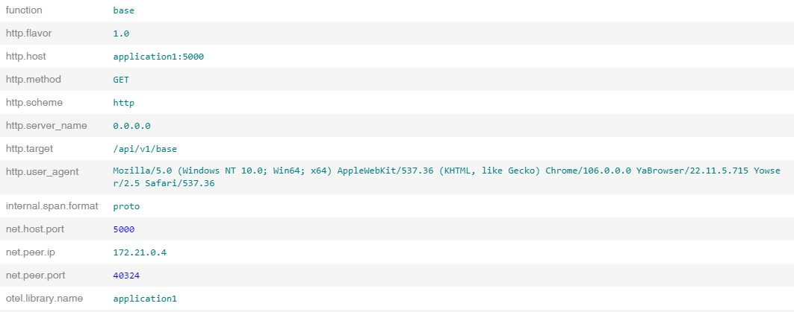
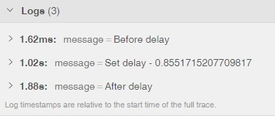
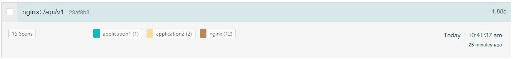
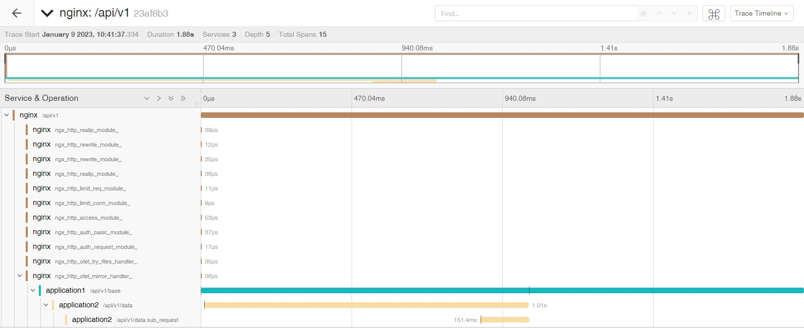

# Tracing

## Наблюдение за приложениями

Существуют три основных набора данных, которые приложения могут предоставлять для отображения своего состояния:

* Логи
* Метрики
* Трассировки

Первые два типа достаточно распространены. Логи существуют почти у всех приложений. Метрики, "со скрипом" но внедряются.
Во всяком случае необходимость наличия метрик понимают большинство разработчиков и администраторов. А вот, как и для
чего следует использовать трассировку (tracing) понимают далеко не все.

Когда мы говорим о трассировке, мы вводим два понятия: span и trace (или distributed trace).

### Span

Span - представляет собой логическую единицу работы, которая имеет название операции, время начала операции и
продолжительность. Span могут быть вложенными и упорядоченными для моделирования причинно-следственных связей.

Span содержит данные, описывающие этот временной диапазон:

* Имя.
* Данные, связанные со временем выполнения.
* Дополнительные метаданные (attributes).

* Структурированные логи (span events). По аналогии с обычными логами - любые сообщения, которые следует сохранить
  в span.

Span формируется путём вызова соответствующей функции SDK в коде приложения. При его формировании автоматически
записывается время создания span.

Обычно во время формирования span в него добавляются атрибуты. В дальнейшем эти атрибуты можно использовать для
поиска интересующих вас групп span.

В промежутке между началом и завершением span, в него можно добавлять span events, формирующие набор логов.

Завершение span формируется, в зависимости от языка программирования, либо непосредственным вызовом соответствующей
функции библиотеки или автоматически.

Обычно span создают в начале какой-либо функции и закрывают его в конце этой функции.

### Trace

Трассировка содержит в себе набор span. Когда вы формируете span, вы указываете trace_id к которому это span относится.
Trace может содержать span различных функций в одном приложении или объединять span из нескольких приложений.

Таким образом мы можем получить информацию например о прохождении запроса через несколько приложений.

## Open Telemetry

[Open Telemetry](https://opentelemetry.io/docs/), также сокращенно известная как OTel - это независимая от поставщика
платформа наблюдения с открытым исходным кодом для инструментирования, генерации, сбора и экспорта телеметрических
данных, таких как трассировки, метрики, журналы. В качестве отраслевого стандарта он изначально поддерживается рядом
поставщиков.

Помимо трассировок, OTel позволяет генерировать метрики и логи. Но эта функциональность может не поддерживаться
библиотеками для конкретных языков программирования. Поэтому на данным момент OTel рекомендуется использовать только
для работы с трассировками.

[Текущее состояние поддержки OTel различных языков программирования](https://opentelemetry.io/docs/instrumentation/#status-and-releases).

Кроме "родного" протокола otel, библиотека поддерживает и некоторые другие, например jaeger-thrift.

### OTel collector

В рамках проекта OTel разработано приложение [collector](https://opentelemetry.io/docs/collector/), позволяющее 
принимать данные от приложений и передавать их в другие приложения, для дальнейшего хранения и обработки.

Для приёма данных используются различные [receivers](https://opentelemetry.io/docs/collector/configuration/#receivers).

После получения данных их можно обработать при
помощи [processors](https://opentelemetry.io/docs/collector/configuration/#processors).

И отправить в разнообразные системы хранения, обработки - 
[exporters](https://opentelemetry.io/docs/collector/configuration/#exporters).

У коллектора большое количество дополнительно поддерживаемых receivers, processors и exporters. Они не включены
в основной дистрибутив (кроме компонент Jaeger и Prometheus). И доступны только в 
[contrib дистрибутиве](https://github.com/open-telemetry/opentelemetry-collector-contrib).

Так же вы можете создать свой вариант дистрибутива при помощи 
[OpenTelemetry Collector Builder](https://github.com/open-telemetry/opentelemetry-collector/tree/main/cmd/builder).

## Opensearch data prepper

Data prepper - это [ещё один коллектор](https://opensearch.org/docs/latest/data-prepper/index/), который разрабатывается
в рамках проекта opensearch.

В основном используется для конвертации спанов в формат, который понимает Observability plugin Opensearch.

Очень требователен к соблюдению формата трейсов otel.

## Jaeger

[Jaeger](https://www.jaegertracing.io/docs/1.41/) - это система для работы с трассировками, позволяющая: получать
трассировки, сохранять их в различных базах данных, показывать и анализировать.

В состав приложения входят:

* jaeger-agent
* jaeger-collector
* jaeger-query
* jaeger-ingester

Ранее в проекте был набор клиентских библиотек для различных языков программирования. Но сейчас рекомендуется
использовать библиотеки проекта OTel.

### Agent

Демон, принимающий span от клиентов по протоколу UDP и пересылающий их на агрегирующие коллекторы.

Предполагается, что на каждом хосту, где будут работать приложения, запускается по агенту. Приложения по UDP скидывают
на агенты span-ы. Таким образом в приложениях нет задержки по отправке span в систему трассировки.

В случае kubernetes, агент можно добавлять непосредственно в под приложения, как дополнительный контейнер.

В дальнейшем агент отправляет полученные span на коллекторы по протоколу Protobuf gRPC/TCP.

Клиенты для взаимодействия с агентом используют специальный протокол - Thrift. Для совместимости со старыми
приложениями, агент может принимать пакеты в формате Zipkin.

### Collector

Принимает span от агентов или непосредственно от приложений. Поддерживает только TCP соединения.

* HTTP jaeger.thrift - используется для получения данных непосредственно от клиентов.
* Protobuf gRPC - используется для получения данных от агентов jaeger. 
* OTLP gRPC
* OTLP HTTP

Отсылает span в различные системы хранения, такие как elasticsearch, cassandra, kafka и т.д. 

[Перечень поддерживаемых storage](https://www.jaegertracing.io/docs/1.41/deployment/#span-storage-backends)

### Query

Jaeger query - это сервис, который предоставляет:

* API для извлечения трассировок из хранилища.
* WEB интерфейс для поиска и анализа трассировок.

### Ingester

Jaeger ingester - это сервис, который считывает трассировки из Kafka и записывает их в серверную часть хранилища. По
сути, это урезанная версия Jaeger collector, которая поддерживает Kafka в качестве единственного протокола ввода.

## Итого

В следующих примерах будут рассмотрены две системы трейсинга:

* Jaeger
* Otel Collector, Data prepper, Opensearch Observability plugin

В качестве хранилища спанов будет использоваться OpenSearch.

Примеры приложений будут написаны на Python с использованием библиотеки
[opentelemetry-python](https://github.com/open-telemetry/opentelemetry-python).

## Разработчикам

[Эта часть](for_developers) предназначена для разработчиков приложений. Хотя, админам тоже рекомендуется
её почитать, для понимания, что можно ожидать от разработчиков :).

## Админам и DevOps-ам

Следующие два раздела предназначены администраторам. Заходим, не стесняемся. 

* [Jaeger](for_admins). 
* [Otel Collector, Data prepper, Opensearch Observability](bonus_pack).