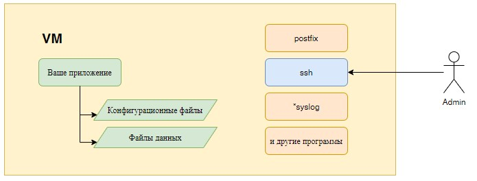
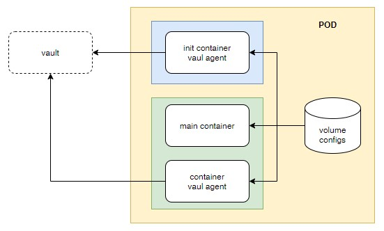

# Концепция работы с конфигами приложений в kubernetes. 

Почему не стоит посылать сигнал HUP? Но если хочется, то как это сделать? 
В качестве примера используем hashicorp vault.

## Благодарности.

Хочу поблагодарить Сергея Андрюнина за комментарии под предыдущим видео и 
[предоставленные материалы](https://gitlab.com/k11s-os/k8s-lessons/-/tree/main/Vault),
на основании которых подготовлено данное видео.

## Немного теории.

Обычно приложения не следят за состоянием своих конфигурационных файлов. Если в конфиги
вносятся какие-либо изменения, приложение это не "видит" и требуется что-то сделать, что бы
приложение перечитало свой конфигурационный файл. В большинстве случаев достаточно послать процессу 
сигнал HUP.

Первое, что нам необходимо понять: администрирование контейнеров отличается от администрирования
виртуальных машин.



При использовании классической виртуальной машины вы получаете доступ по ssh. В случае контейнера,
такого доступа не будет.

Если вы планируете изменять конфигурационный файлы в контейнерах, эти файлы обычно выносятся во внешние volumes. В
случае kubernetes - это делается при помощи ConfigMap и Secret. Хотя, конечно можно использовать и обычные volumes.

После изменения, например ConfigMap, содержимое конфигурационных файлов в контейнерах изменится. Но само приложение
их не перечитает. Парадигма работы с контейнерами предусматривает, что для применения новых конфигурационных
параметров контейнер необходимо перезапустить, а не посылать сигнал процессу внутри контейнера. Поэтому в kubernetes 
после изменения ConfigMap или Secret контейнеры рестартуют. Это можно делать вручную или при помощи специальных 
приложений, например [Reloader](https://github.com/stakater/Reloader).

### Vault

Вернёмся к задаче подстановки данных из Hashicorp vault в конфиги, которую мы решали в [предыдущем видео](../README.md).
Там значения из vault подставлялись в файлы в volume при помощи secrets-store-csi-driver. Volume со значениями из
vault подключался один раз в initContainer. На основании данных этого volume генерировались конфигурационные файлы,
которые по соображениям безопасности размещались в RAM диске. Init контейнер завершал свою работу, volume с данными из
vault отключался и больше ни где в системе не отображался. Всё безопасно и красиво.

Но, если значения в vault изменялись, нам приходилось в ручную рестартовать под. Т.е. мы не 
могли стандартными средствами следить за изменением значений в vault и как то реагировать на это. 

В данном видео мы посмотрим как можно решить эту проблему.

При изменении информации в vault, приложение [агент](https://www.vaultproject.io/docs/agent) 
вносит изменения в конфигурационные файлы во время работы программы. Агент не может перезапустить контейнер 
в kubernetes. Во всяком случае я такого решения без написания дополнительного приложения и танцев с бубном не знаю. 
Но agent может, после внесения изменений выполнить простейший скрипт, который пошлёт сигнал HUP процессу, что бы он 
перечитал свою конфигурацию.

В первом приближении под приложения будет выглядеть следующим образом:



Init контейнер, [агент vault](https://www.vaultproject.io/docs/agent) читает данные из vault. 
Подставляет необходимые значения в итоговый конфиг.

Дальше запускаются два контейнера в поде: основное приложение и агент vault, который будет следить за изменениями в 
vault. Если такие изменения были, формировать конфигурационный файл и посылать сигнал HUP основному приложению, что бы
оно перечитало свой конфиг.

Вроде всё просто. Но есть одно НО - контейнеры изолированны друг от друга. Т.е. вы не можете из одного контейнера 
"залезть" в другой и послать сигнал процессу в этом контейнере. И это правильно. Ибо - **Б** (безопасность).

В нашем случае, что бы всё работало, придётся на это **Б** забить. _Согласитесь. Какой неожиданный поворот. 
Vault про безопасность, но что бы он работал нам приходится эту самую безопасность нагибать_.

### shareProcessNamespace

Итак, если вы хотите, что бы другие контейнеры пода могли иметь доступ к вашему контейнеру - используйте 
[shareProcessNamespace](https://kubernetes.io/docs/tasks/configure-pod-container/share-process-namespace/)

В темплейте пода добавьте:

```yaml
    spec:
      shareProcessNamespace: true
```

Каковы последствия? (_простите, но дальше google translate_)

1. Процесс контейнера больше не имеет PID 1. Некоторые образы контейнеров отказываются запускаться без PID 1 
(например, контейнеры, использующие systemd) или запускать такие команды, как kill -HUP 1, чтобы сигнализировать 
процессу контейнера. В модулях с общим пространством имен процессов kill -HUP 1 будет сигнализировать о песочнице модуля.
(/пауза в приведенном выше примере.)
2. Процессы видны другим контейнерам в поде. Сюда входит вся информация, видимая в /proc, например, пароли, 
которые были переданы в качестве аргументов или переменных среды. Они защищены только обычными разрешениями Unix.
3. Файловые системы контейнеров видны другим контейнерам в поде по ссылке /proc/$pid/root. Это упрощает отладку, 
но также означает, что секреты файловой системы защищены только разрешениями файловой системы.

Вобщем, как вы, надеюсь, понимаете дальше будет без **Б**.

Так же, непосредственно в контейнере, который будет перезапускать (посылать сигнал) основной контейнер, добавляем 
[capabilities](https://kubernetes.io/docs/tasks/configure-pod-container/security-context/#set-capabilities-for-a-container)
(_[man page capabilities](https://man7.org/linux/man-pages/man7/capabilities.7.html)_):

```yaml
          securityContext:
            capabilities:
              add:
                - SYS_PTRACE
```

Так же надо позаботиться, что бы все контейнеры в поде работали с правами одного и того же пользователя. Nginx
работает с правами пользователя nginx(101). Так настроен контейнер от производителя. Поэтому для vault агентов поставим
именно его:

```yaml
          securityContext:
            runAsUser: 101
            runAsNonRoot: true
```

## Практика

### Установка vault

Будем ставить vault по упрощённой dev схеме без secrets-store-csi-driver.

**Внимание!** Данная установка vault после рестарта контейнера сбрасывает все данные! Если хотите использовать HA,
смотрите [предыдущее видео](../README.md). 

Файл [values.yaml](values.yaml).

    helm repo add hashicorp https://helm.releases.hashicorp.com
    helm repo update
    helm install --namespace vault --create-namespace vault hashicorp/vault -f values.yaml

Смотрим статус:

     kubectl -n vault exec vault-0 -- vault status

### Добавляем сикреты

    kubectl -n vault exec -it vault-0 -- /bin/sh
    vault login root

    vault auth enable kubernetes
    vault auth list
    vault write auth/kubernetes/config \
        kubernetes_host="https://kubernetes.default.svc:443" \
        token_reviewer_jwt="$(cat /var/run/secrets/kubernetes.io/serviceaccount/token)" \
        kubernetes_ca_cert=@/var/run/secrets/kubernetes.io/serviceaccount/ca.crt \
        issuer="https://kubernetes.default.svc.cluster.local"

Добавляем секрет

    vault kv put secret/application application="HelloPassword" user="Vasiliy" password="MegaPassword"
    vault kv get secret/application

Создаём политику

    vault policy write internal-app - <<EOF
    path "secret/data/application" {
      capabilities = ["read"]
    }
    EOF
    vault policy read internal-app

Создаём роль

    vault write auth/kubernetes/role/application \
    bound_service_account_names=application-sa \
    bound_service_account_namespaces=default \
    policies=internal-app \
    ttl=20m

## Приложение

В качестве приложения будем использовать nginx. Файл, в котором будут подставляться значения из vault - index.html.

Файл деплоймента - [02-nginx.yaml](manifests-app/02-nginx.yaml). Согласно схемы:


Кроме основного приложения (nginx) добавлен init контейнер с vault агентом. Задача которого - первоначальное формирвание
файла index.html. Он по сути выполняет такую же задачу, как и init контейнер в предыдущем видео. Но другим способом.

```yaml
      initContainers:
        - name: init-config
          image: vault:1.9.3
          imagePullPolicy: IfNotPresent
          securityContext:
            runAsUser: 101
            runAsNonRoot: true
            capabilities:
              add:
                - IPC_LOCK
          args:
            - "agent"
            - "-config=/etc/vault/config/vault-agent-init.hcl"
          env:
            - name: SKIP_SETCAP
              value: 'true'
          volumeMounts:
          - mountPath: /etc/vault/config
            name: vault-agent-configs
          - mountPath: /etc/vault/config/template/
            name: config-template
          - mountPath: /etc/vault/config/render/
            name: config
```

Второй контейнер с vault агентом, работает постоянно. Его задача - с определённой периодичностью посылать запросы в
vault, и вносить изменения в index.html. Если изменения были - посылать сигнал HUP процессу nginx.

```yaml
        - name: vault-agent-rerender
          image: vault:1.9.3
          imagePullPolicy: IfNotPresent
          securityContext:
            runAsUser: 101
            runAsNonRoot: true
            allowPrivilegeEscalation: false
            capabilities:
              add:
                - IPC_LOCK
                - SYS_PTRACE
          args:
            - "agent"
            - "-config=/etc/vault/config/vault-agent-reload.hcl"
```

Все конфигурационные файлы храняться в [01-cm.yaml](manifests-app/01-cm.yaml).

Конфигурация vault из init контейнера:

```yaml
  vault-agent-init.hcl: |
    pid_file = "/tmp/.pidfile"
    auto_auth {
      method "kubernetes" {
        config = {
          role = "application"
        }
      }
    }
    template {
      source      = "/etc/vault/config/template/index.html.template"
      destination = "/etc/vault/config/render/index.html"
    }
    vault {
      address = "http://vault.vault.svc:8200"
    }
    exit_after_auth = true
```

Секция [auto_auth](https://www.vaultproject.io/docs/agent/autoauth) определяет метод аутентификации. У нас в vault
включена аутентификация kubernetes. Соответственно мы будем пользоваться её. Тут достаточно указать роль в vault, которую
следует использовать.

Секция vault указывает vault к которому мы будем обращаться. В нашем случае он находится непосредственно в кластере
kubernetes. В namespace vault.

exit_after_auth - говорит, что после первой аутентификации и выполнения секции template, приложение завершит свою
работу. Это у нас init контейнер, он должен один раз что то выполнить и отключится.

Секция [template](https://www.vaultproject.io/docs/agent/template). Тут просто: источник и куда поместить обработанную
информацию.

```yaml
  vault-agent-reload.hcl: |
    pid_file = "/tmp/.pidfile"
    auto_auth {
      method "kubernetes" {
        config = {
          role = "application"
        }
      }
    }
    template {
      source      = "/etc/vault/config/template/index.html.template"
      destination = "/etc/vault/config/render/index.html"
      command = "ps ax | grep 'nginx: maste[r]' | awk '{print $1}' | xargs kill -s HUP"
    }
    template_config {
          static_secret_render_interval = "1m"
    }
    vault {
      address = "http://vault.vault.svc:8200"
    }
```

Конфигурация основного vault агента аналогична init, но содержит изменения:
* Отсутствует параметр exit_after_auth.
* В секции template добавлен параметр command. Тут надеюсь всё понятно.
* Добавлена секция template_config, в которой определяет периодичность обращения к vault.

## Шаблоны

Файл шаблона index.html.template:

```yaml
  index.html.template: |
    <html>
    <head>
        <title>Тестовая страница</title>
        <meta charset="UTF-8">
    </head>
    <body>
      <h1>Тестовая страница</h1>

      <p>Вот тут мы подставляем данные из hashicorp vault:</p>
      <p>Приложение: <b>{{ with secret "secret/application" }}{{ .Data.data.application }}{{ end }}</b></p>
      <p>Пользователь: <b>{{ with secret "secret/application" }}{{ .Data.data.user }}{{ end }}</b></p>
      <p>Пароль: <b>{{ with secret "secret/application" }}{{ .Data.data.password }}{{ end }}</b></p>

    </body>
    </html>
```

## Видео

[](https://youtu.be/bWZ_EmMQEyM)